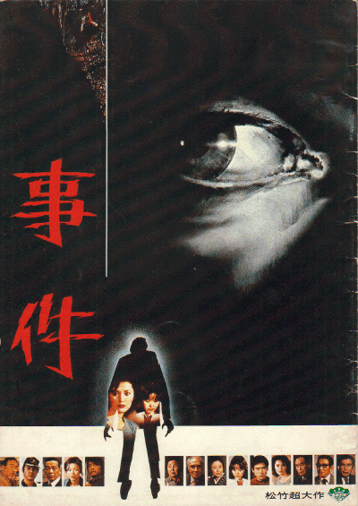

------

------

野村芳太郎于1978年导演了两部名作，一部是*\<鬼畜\>*，另一部就是*\<事件\>*。

一直以来，*\<事件\>*的中文字幕都是港版的粤语翻译，对于普通话观众来说晦涩难懂。

本人基于chenchun8219的粤语字幕，进行字幕轴校对和二次润色，将粤语难懂用词全部换成普通话，并对比英文字幕，增补修正很多翻译错漏，适用于2:18:19版本。

------

The English Translation that used in my Chinese re-translation is taken from the Internet. If contacted by the owner of the subtitle, I will take it off my site.

------

**粤语中文字幕提供**: chenchun8219 
**普通话中文重译/字幕轴重新校对**: coralsundy (coralsundy@gmail.com)

------

**中文字幕**: [Jiken.aka.The.Incident.1978.chs.02-18-19.synced.and.retranslated.BYcoralsundy.srt](../subtitles/Jiken.aka.The.Incident.1978.chs.02-18-19.synced.and.retranslated.BYcoralsundy.srt) 
**English Subtitle Reference**: [Jiken.aka.The.Incident.1978.eng.ass](../subtitles/Jiken.aka.The.Incident.1978.eng.ass)

------

**SUBHD**: <https://subhd.tv/a/515838> 
**IMDB**: <https://www.imdb.com/title/tt0202932/> 
**DOUBAN**: <https://movie.douban.com/subject/1303838/>

------

**More Movie Subtitles on My Website**: <a href=''>CLICK HERE</a>

