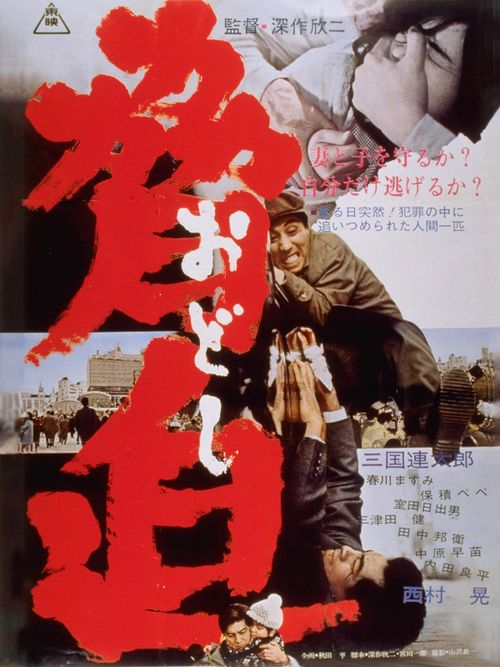

------

------

深作欣二在**\<无任义之战系列\>**发布前的杰作。他于1966年自编自导**\<胁迫(脅迫)\>**(宫川一郎合作脚本)，由三国连太郎出演的电影。中文字幕由coralsundy自费出资，neola09听译制作。适用于01:23:54的版本。仅供个人兴趣学习使用，不得商业化和付费。

------

**No English Subtitle**

------

**听译/字幕**: noela09 (noela1990@outlook.com) 
**审核/调整**: coralsundy (coralsundy@gmail.com) 
*(由coralsundy自费出资制作, 仅供个人学习)*

------

**中文字幕**: [Odoshi.aka.The.Threat.1966.chs.01-23-54.BYnoela09.rev1.srt](../subtitles/Odoshi.aka.The.Threat.1966.chs.01-23-54.BYnoela09.rev1.srt) 
**English Subtitle**: None

------

**SUBHD**: <https://subhd.tv/a/522486> 
**IMDB**: <https://www.imdb.com/title/tt0323472/> 
**DOUBAN**: <https://movie.douban.com/subject/4040887/>

------

**More Movie Subtitles on My Website**: <a href=''>CLICK HERE</a>

