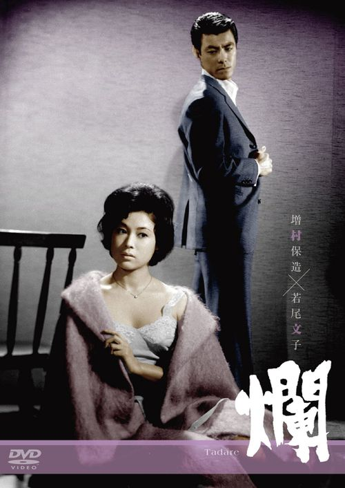

------

------

烂 (爛 Tadare) 是1962年由增村保造导演，新藤兼人脚本，池野成音乐，若尾文子和田宫二郎主演的电影。英文字幕由coralsundy自费出资，jls001999听译制作，有少许错漏和语句不够流畅，可全程完整欣赏电影，适用于01:28:30的版本。仅供个人兴趣学习使用，不得商业化和付费。如有中文字幕翻译是基于此英文字幕，敬请标明出处。

------

Tadare/Stolen Pleasure (1962) is a movie directed by Yasuzô Masumura. Script written by Kaneto Shindô and music composed by Sei Ikeno. Notable casts including Ayako Wakao，Jirô Tamiya，and Eiji Funakoshi. 

------

**Translation/Subtitle**: jls001999 (jls001999@gmail.com) 
**Review/Proofreading**: coralsundy (coralsundy@gmail.com) 
*(Paid by coralsundy for the translation, personal use only)*

------

**中文字幕**: 尚无 
**English Subtitle**: [Tadare.aka.Stolen.Pleasure.1962.eng.01-28-30.BYjls001999.rev1.srt](../subtitles/Tadare.aka.Stolen.Pleasure.1962.eng.01-28-30.BYjls001999.rev1.srt)

------

**SUBHD**: <https://subhd.tv/a/522488> 
**IMDB**: <https://www.imdb.com/title/tt0310199/> 
**DOUBAN**: <https://movie.douban.com/subject/2361063/>

------

**More Movie Subtitles on My Website**: <a href=''>CLICK HERE</a>

