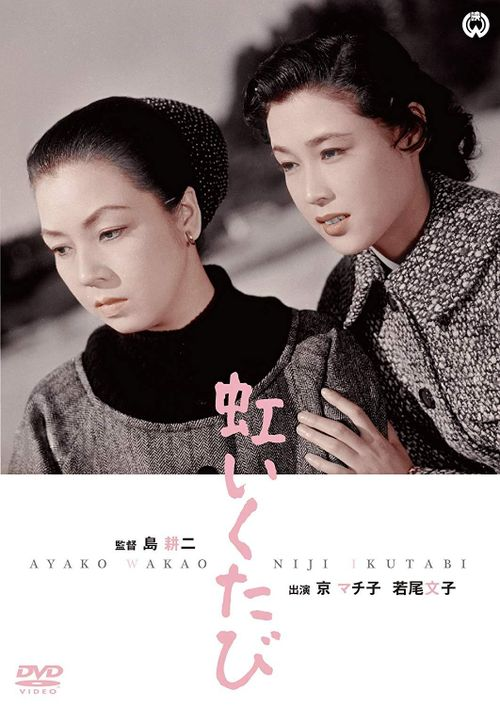

------

------

虹いくたび (A Rainbow At Every Turn) 是島耕二于1956年导演，川端康成原作，八住利雄编剧， 京町子/若尾文子主演的电影。英文字幕由coralsundy自费出资，jls001999听译制作完成。有少许错漏和语句不够流畅，可全程完整欣赏电影，适用于01:39:33的版本。

------

Niji Ikutabi / A Rainbow at Every Turn (1956) is a movie directed by Kôji Shima, based on the novel from Yasunari Kawabata. Notable casts including Machiko Kyô, Ayako Wakao, and Eiji Funakoshi.

------

**Translation/Subtitle**: jls001999 (jls001999@gmail.com) 
**Review/Proofreading**: coralsundy (coralsundy@gmail.com) 
*(Paid by coralsundy for the translation, personal use only)*

------

**中文字幕**: 尚无 
**English Subtitle**: [Niji.Ikutabi.aka.A.Rainbow.at.Every.Turn.1956.eng.01-39-33.BYjls001999.rev2.srt](../subtitles/Niji.Ikutabi.aka.A.Rainbow.at.Every.Turn.1956.eng.01-39-33.BYjls001999.rev2.srt)

------

**SUBHD**: <https://subhd.tv/a/523287> 
**IMDB**: <https://www.imdb.com/title/tt5330102/> 
**DOUBAN**: <https://movie.douban.com/subject/26780005/>

------

**More Movie Subtitles on My Website**: <a href=''>CLICK HERE</a>

