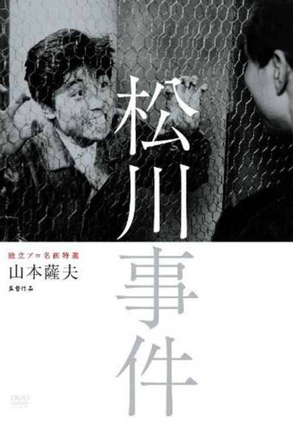

------

------

松川事件 (Matsukawa Jiken) 是山本萨夫于1961年执导，新藤兼人脚本的电影。中文字幕由coralsundy自费出资，neola09听译制作。适用于02:42:17的版本。

------

**No English Subtitle**

------

**听译/字幕**: noela09 (noela1990@outlook.com) 
**审核/调整**: coralsundy (coralsundy@gmail.com) 
*(由coralsundy自费出资制作, 仅供个人学习)*

------

**中文字幕**: [Matsukawa.Jiken.aka.The.Matsukawa.Incident.1961.chs.02-42-17.BYnoela09.rev1.srt](../subtitles/Matsukawa.Jiken.aka.The.Matsukawa.Incident.1961.chs.02-42-17.BYnoela09.rev1.srt) 
**English Subtitle**: None

------

**SUBHD**: <https://subhd.tv/a/523411> 
**IMDB**: <https://www.imdb.com/title/tt0055154/> 
**DOUBAN**: <https://movie.douban.com/subject/5059452/>

------

**More Movie Subtitles on My Website**: <a href=''>CLICK HERE</a>

