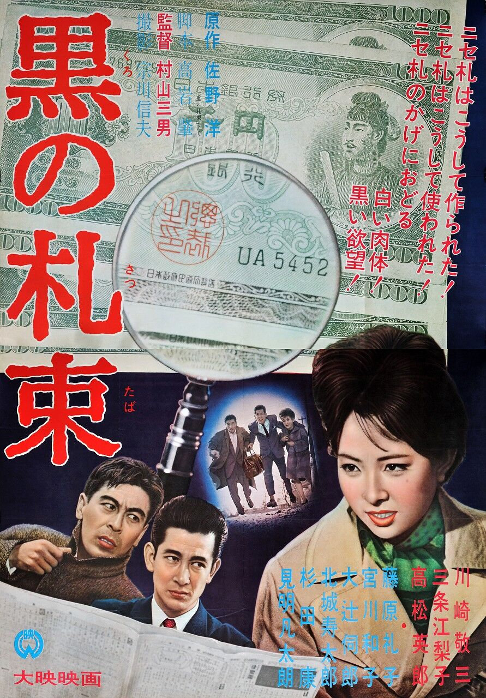

------

------

黑色钱币 / 黒の札束 (Black Money) 是村山三男于1963年导演的电影，大映《黑色系列》的第3作。英文字幕由coralsundy自费出资，jls001999听译制作完成。有少许错漏和语句不够流畅，可全程完整欣赏电影，适用于01:32:58的版本。

------

Kuro no satsutaba / Black Money (1963) is the 3rd installment of the "Black Series" from Daiei Film. It was directed by Mitsuo Murayama, with notable casts Keizô Kawasaki and Hideo Takamatsu.

------

**Translation/Subtitle**: jls001999 (jls001999@gmail.com) 
**Review/Proofreading**: coralsundy (coralsundy@gmail.com) 
*(Paid by coralsundy for the translation, personal use only)*

------

**中文字幕**: 尚无 
**English Subtitle**: [Kuro.no.Satsutaba.aka.Black.Money.1963.eng.01-32-58.BYjls001999.rev1.srt](../subtitles/Kuro.no.Satsutaba.aka.Black.Money.1963.eng.01-32-58.BYjls001999.rev1.srt)

------

**SUBHD**: <https://subhd.tv/a/523633> 
**IMDB**: <https://www.imdb.com/title/tt8947228/> 
**DOUBAN**: <https://movie.douban.com/subject/34778330/>

------

**More Movie Subtitles on My Website**: <a href=''>CLICK HERE</a>

