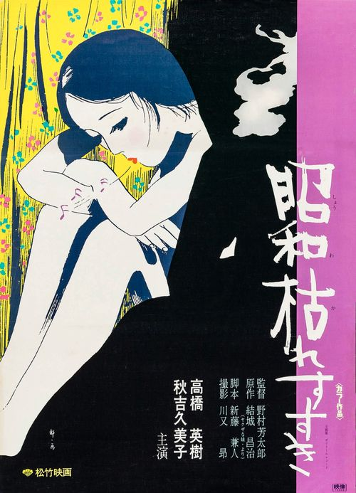

------

------

昭和枯草哀歌 (The Perennial Weed) 是野村芳太郎于1975年执导，新藤兼人/结城昌治脚本，高桥英树/秋吉久美子主演的电影。中文字幕由coralsundy自费出资，neola09听译制作。适用于01:27:25的版本。

------

**No English Subtitle**

------

**听译/字幕**: noela09 (noela1990@outlook.com) 
**审核/调整**: coralsundy (coralsundy@gmail.com) 
*(由coralsundy自费出资制作, 仅供个人学习)*

------

**中文字幕**: [Showa.Karesusuki.aka.The.Perennial.Weed.1975.chs.01-27-25.BYnoela09.rev1.srt](../subtitles/Showa.Karesusuki.aka.The.Perennial.Weed.1975.chs.01-27-25.BYnoela09.rev1.srt) 
**English Subtitle**: None

------

**SUBHD**: <https://subhd.tv/a/523844> 
**IMDB**: <https://www.imdb.com/title/tt0323970/> 
**DOUBAN**: <https://movie.douban.com/subject/10575169/>

------

**More Movie Subtitles on My Website**: <a href=''>CLICK HERE</a>

