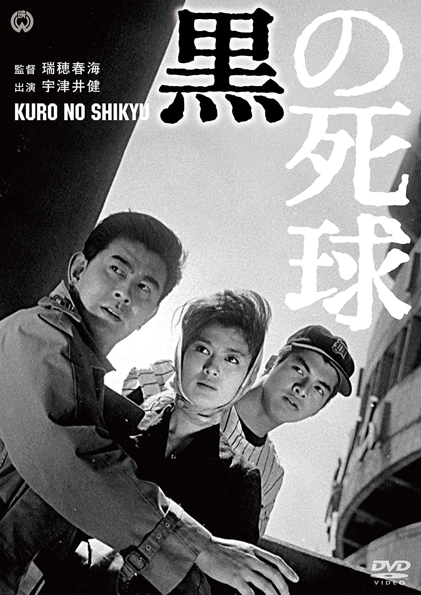

------

------

黒の死球 (Black Death Ball) 是瑞穂春海于1963年导演，宇津井健/藤由紀子主演的电影，大映<黑色系列>的第4作。英文字幕由coralsundy自费出资，jls001999听译制作完成。有少许错漏和语句不够流畅，可全程完整欣赏电影，适用于01:23:27的版本。

------

Kuro no Shikyu / Black Death Ball (1963) is the 4th installment of the "Black Series" from Daiei Film. It was directed by Shunkai Mizuho, with notable casts Ken Utsui.

------

**Translation/Subtitle**: jls001999 (jls001999@gmail.com) 
**Review/Proofreading**: coralsundy (coralsundy@gmail.com) 
*(Paid by coralsundy for the translation, personal use only)*

------

**中文字幕**: 尚无 
**English Subtitle**: [Kuro.no.Shikyu.aka.Black.Death.Ball.1963.eng.01-23-27.BYjls001999.rev1.srt](../subtitles/Kuro.no.Shikyu.aka.Black.Death.Ball.1963.eng.01-23-27.BYjls001999.rev1.srt)

------

**SUBHD**: <https://subhd.tv/a/524332> 
**IMDB**: None 
**DOUBAN**: <https://movie.douban.com/subject/34778331/>

------

**More Movie Subtitles on My Website**: <a href=''>CLICK HERE</a>

