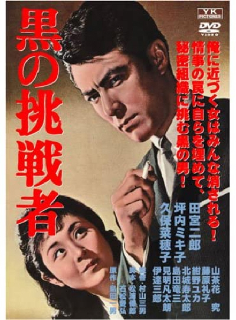

------

------

黑色挑战者 / 黒の挑戦者 (Black Challenger) 是村山三男于1964年导演，田宫二郎主演的电影。大映《黑色系列》的第8作。英文字幕由coralsundy自费出资，jls001999听译制作完成。有少许错漏和语句不够流畅，可全程完整欣赏电影，适用于01:23:30的版本。

------

Kuro no Chosensha / Black Challenger (1964) is the 8th installment of the "Black Series" from Daiei Film. It was directed by Mitsuo Murayam, with notable stars Jiro Tamiya and others.

------

**Translation/Subtitle**: jls001999 (jls001999@gmail.com) 
**Review/Proofreading**: coralsundy (coralsundy@gmail.com) 
*(Paid by coralsundy for the translation, personal use only)*

------

**中文字幕**: 尚无 
**English Subtitle**: [Kuno.no.Chosensha.aka.Black.Challenger.1964.eng.01-23-30.BYjls001999.rev1.srt](../subtitles/Kuno.no.Chosensha.aka.Black.Challenger.1964.eng.01-23-30.BYjls001999.rev1.srt)

------

**SUBHD**: <https://subhd.tv/a/525142> 
**IMDB**: <https://www.imdb.com/title/tt8933654/> 
**DOUBAN**: <https://movie.douban.com/subject/34778360/>

------

**More Movie Subtitles on My Website**: <a href=''>CLICK HERE</a>

