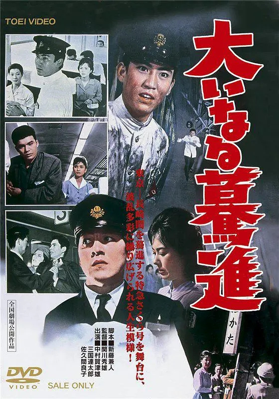

------

------

伟大进步 / 大いなる驀進 / Oinaru Bakushin (Devotion to Railway) 是関川秀雄于1960年执导，新藤兼人脚本，中村嘉葎雄/三國連太郎/佐久間良子主演的电影，是同年出品的<伟大征程/大いなる旅路 (Oinaru Tabiji)>的续作。中文字幕由coralsundy自费出资，neola09听译制作。适用于01:28:52的版本。

------

**No English Subtitle**

------

**听译/字幕**: noela09 (noela1990@outlook.com) 
**审核/调整**: coralsundy (coralsundy@gmail.com) 
*(由coralsundy自费出资制作, 仅供个人学习)*

------

**中文字幕**: [Oinaru.Bakushin.aka.Devotion.to.Railway.1960.chs.01-28-52.BYnoela09.rev1.srt](../subtitles/Oinaru.Bakushin.aka.Devotion.to.Railway.1960.chs.01-28-52.BYnoela09.rev1.srt) 
**English Subtitle**: None

------

**SUBHD**: <https://subhd.tv/a/526302> 
**IMDB**: <https://www.imdb.com/title/tt0383731/> 
**DOUBAN**: <https://movie.douban.com/subject/5233564/>

------

**More Movie Subtitles on My Website**: <a href=''>CLICK HERE</a>

