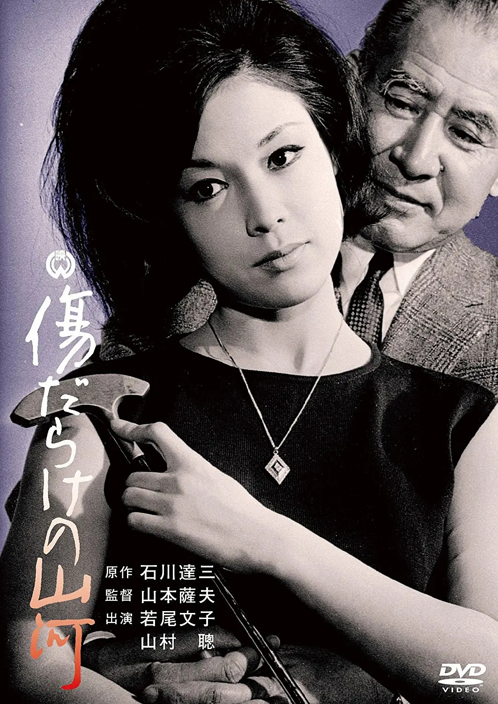

------

------

多伤的山河 / 傷だらけの山河 (A Public Benefactor / The Tycoon) 是山本萨夫于1964年导演，新藤兼人脚本，山村聪/若尾文子/船越英二主演的电影。英文字幕由coralsundy自费出资，jls001999听译制作完成。有少许错漏和语句不够流畅，可全程完整欣赏电影，适用于02:31:51的版本。

------

Kizudarake no Sanga / A Public Benefactor / The Tycoon (1964) is a 1964 movie directed by Satsuo Yamamoto, with notable stars So Yamamura, Ayako Wakao and Eiji Funakoshi.

------

**Translation/Subtitle**: jls001999 (jls001999@gmail.com) 
**Review/Proofreading**: coralsundy (coralsundy@gmail.com) 
*(Paid by coralsundy for the translation, personal use only)*

------

**中文字幕**: 尚无 
**English Subtitle**: [Kizudarake.no.Sanga.aka.The.Tycoon.1964.eng.02-31-51.BYjls001999.rev1.srt](../subtitles/Kizudarake.no.Sanga.aka.The.Tycoon.1964.eng.02-31-51.BYjls001999.rev1.srt)

------

**SUBHD**: <https://subhd.tv/a/526487> 
**IMDB**: <https://www.imdb.com/title/tt0317838/> 
**DOUBAN**: <https://movie.douban.com/subject/3176998/>

------

**More Movie Subtitles on My Website**: <a href=''>CLICK HERE</a>

