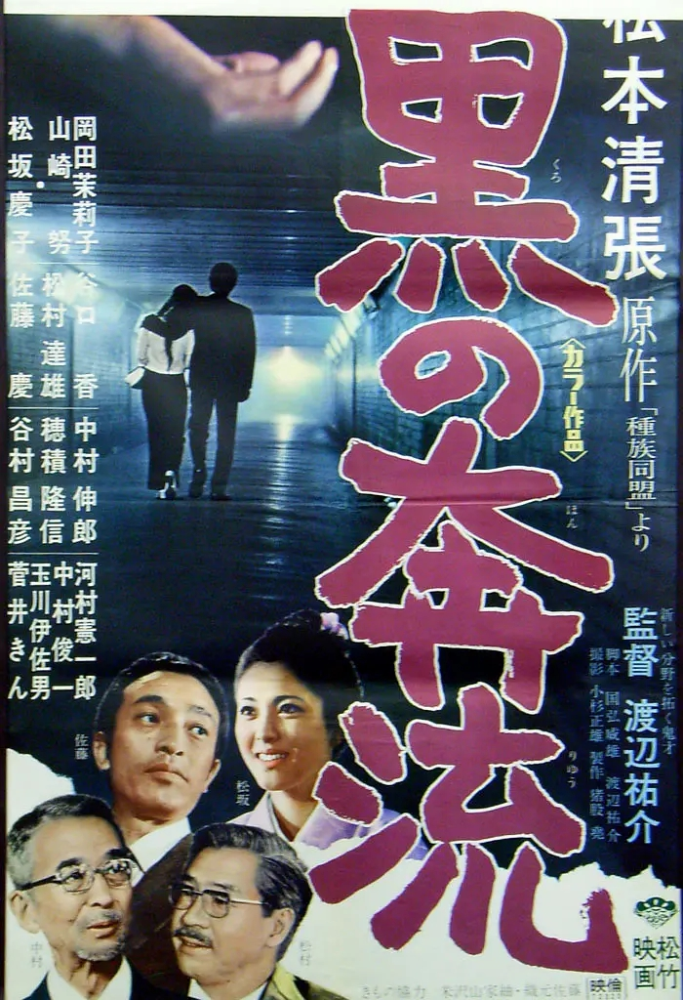

------

------

黑色漩涡 / 黒の奔流 (Ordinary Darkness) 是渡边祐介于1972年导演(国弘威雄合作脚本)，山崎努 / 冈田茉莉子 / 松坂庆子 / 佐藤庆主演的电影，基于松本清张原作改编。英文字幕由coralsundy自费出资，jls001999听译制作完成。有少许错漏和语句不够流畅，可全程完整欣赏电影，适用于01:30:33的版本。

------

Kuro no Honryu / Ordinary Darkness (1972) is a 1972 movie directed by Yusuke Watanabe, with notable stars Tsutomu Yamazaki, Mariko Okada, Keiko Matsuzaka, and Kei Sato. It is based on a story by Seicho Matsumoto.

------

**Translation/Subtitle**: jls001999 (jls001999@gmail.com) 
**Review/Proofreading**: coralsundy (coralsundy@gmail.com) 
*(Paid by coralsundy for the translation, personal use only)*

------

**中文字幕**: 尚无 
**English Subtitle**: [Kuro.no.Honryu.aka.Ordinary.Darkness.1972.eng.01-30-33.BYjls001999.rev1.srt](../subtitles/Kuro.no.Honryu.aka.Ordinary.Darkness.1972.eng.01-30-33.BYjls001999.rev1.srt)

------

**SUBHD**: <https://subhd.tv/a/527226> 
**IMDB**: <https://www.imdb.com/title/tt0352506/> 
**DOUBAN**: <https://movie.douban.com/subject/3402833/>

------

**More Movie Subtitles on My Website**: <a href=''>CLICK HERE</a>

