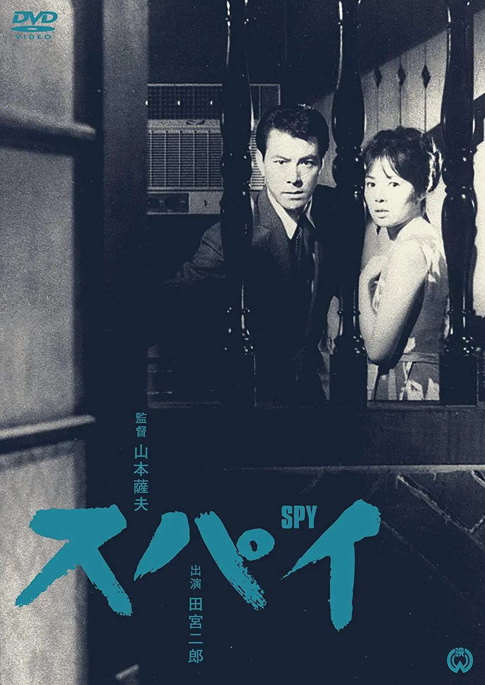

------

------

间谍 / スパイ(Spy / Supai) 是山本萨夫于1965年导演，田宫二郎 / 小川真由美主演的电影。英文字幕由coralsundy自费出资，jls001999听译制作完成。有少许错漏和语句不够流畅，可全程完整欣赏电影，适用于01:35:22的版本。

------

Supai / Spy is (1965) a 1965 movie directed by Satsuo Yamamoto, with notable stars Jiro Tamiya and Mayumi Ogawa.

------

**Translation/Subtitle**: jls001999 (jls001999@gmail.com) 
**Review/Proofreading**: coralsundy (coralsundy@gmail.com) 
*(Paid by coralsundy for the translation, personal use only)*

------

* Update to rev2 with some text improvements

**中文字幕**: 尚无 
**English Subtitle**: [Supai.aka.Spy.1965.eng.01-35-22.BYjls001999.rev2.srt](../subtitles/Supai.aka.Spy.1965.eng.01-35-22.BYjls001999.rev2.srt)

------

**SUBHD**: <https://subhd.tv/a/527988> 
**IMDB**: <https://www.imdb.com/title/tt0258228/> 
**DOUBAN**: <https://movie.douban.com/subject/5140686/>

------

**More Movie Subtitles on My Website**: <a href=''>CLICK HERE</a>

