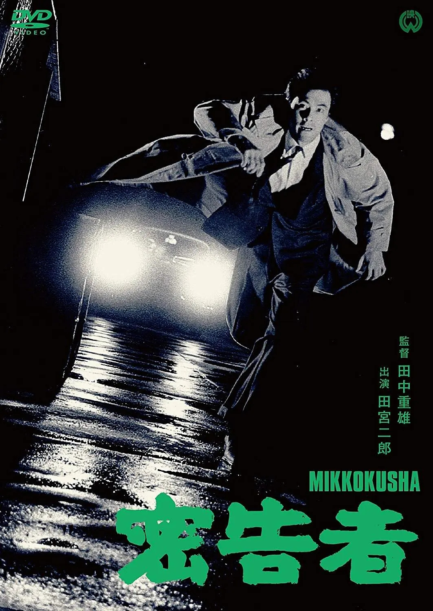

------

------

密告者 (Betrayer/Mikkokusha) 是田中重雄于1965年导演，田宫二郎/藤村志保/江波杏子主演的电影。英文字幕由coralsundy自费出资，jls001999听译制作完成。有少许错漏和语句不够流畅，可全程完整欣赏电影，适用于01:21:07的版本。

------

Mikkokusha / Betrayer (1965) ia a 1965 movie directed by Shigeo Tanaka, with notable stars Jiro Tamiya, Shiho Fujimura, and Kyoko Enami.

------

**Translation/Subtitle**: jls001999 (jls001999@gmail.com) 
**Review/Proofreading**: coralsundy (coralsundy@gmail.com) 
*(Paid by coralsundy for the translation, personal use only)*

------

**中文字幕**: 尚无 
**English Subtitle**: [Mikkokusha.aka.Betrayer.1965.eng.01-21-07.BYjls001999.rev1.srt](../subtitles/Mikkokusha.aka.Betrayer.1965.eng.01-21-07.BYjls001999.rev1.srt)

------

**SUBHD**: <https://subhd.tv/a/528433> 
**IMDB**: <https://www.imdb.com/title/tt8478976/> 
**DOUBAN**: <https://movie.douban.com/subject/30419013/>

------

**More Movie Subtitles on My Website**: <a href=''>CLICK HERE</a>

