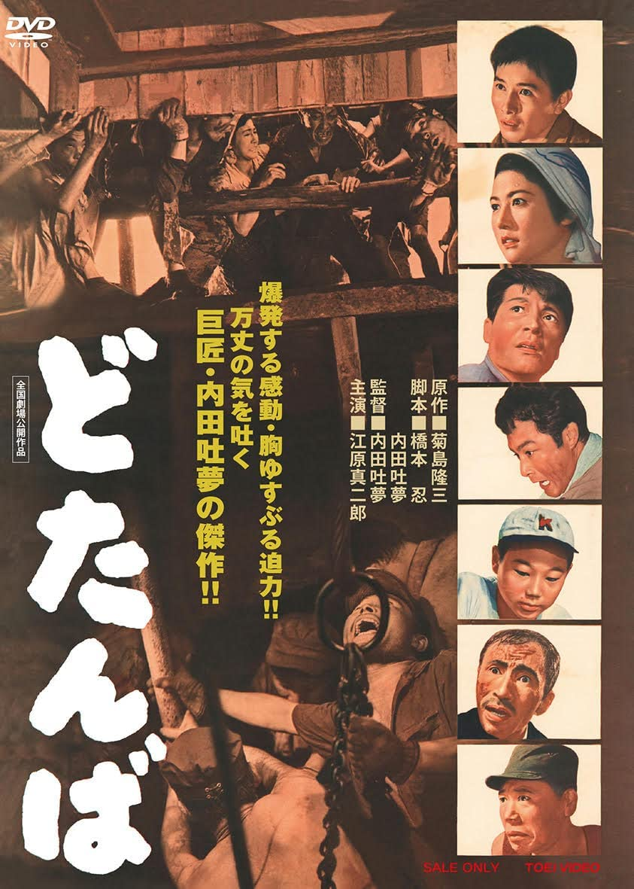

------

------

最后关头/どたんば (Dotanba / The Eleventh Hour) 是内田吐梦于1957年执导，与桥本忍合作脚本，江原真二郎/中村雅子/冈田英次/加藤嘉/东野英治郎/志村乔主演的电影。中文字幕由coralsundy自费出资，neola09听译制作。适用于01:47:45的版本。

------

**No English Subtitle**

------

**听译/字幕**: noela09 (noela1990@outlook.com) 
**审核/调整**: coralsundy (coralsundy@gmail.com) 
*(由coralsundy自费出资制作, 仅供个人学习)*

------

**中文字幕**: [Dotanba.aka.The.Eleventh.Hour.1957.chs.01-47-45.BYnoela09.rev1.srt](../subtitles/Dotanba.aka.The.Eleventh.Hour.1957.chs.01-47-45.BYnoela09.rev1.srt) 
**English Subtitle**: None

------

**SUBHD**: <https://subhd.tv/a/528977> 
**IMDB**: <https://www.imdb.com/title/tt0379760/> 
**DOUBAN**: <https://movie.douban.com/subject/4145753/>

------

**More Movie Subtitles on My Website**: <a href=''>CLICK HERE</a>

