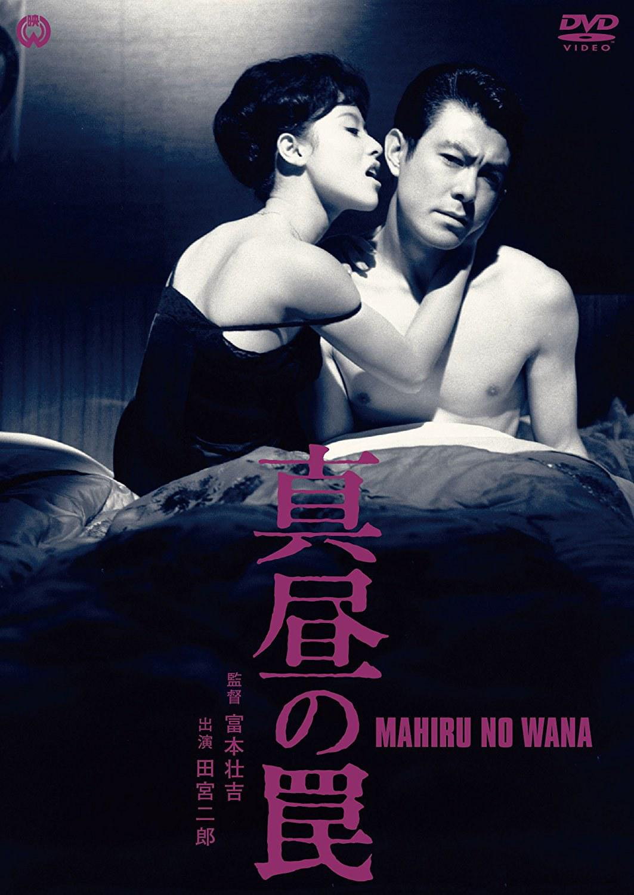

------

------

真昼の罠/午间陷阱 (Mahiru no Wana) 是富本壮吉于1962年导演，改编自黒岩重吾原作小说，田宫二郎/叶顺子主演的电影。英文字幕由coralsundy自费出资，jls001999听译制作完成。有少许错漏和语句不够流畅，可全程完整欣赏电影，适用于01:29:33的版本。

------

Mahiru no Wana / Midday Trap (1962) is a 1962 movie directed by Sokichi Tomimoto, based on the original novel of Jugo Kuroiwa, with notable stars Jiro Tamiya and Junko Kano.

------

**Translation/Subtitle**: jls001999 (jls001999@gmail.com) 
**Review/Proofreading**: coralsundy (coralsundy@gmail.com) 
*(Paid by coralsundy for the translation, personal use only)*

------

**中文字幕**: 尚无 
**English Subtitle**: [Mahiru.no.Wana.aka.Midday.Trap.1962.eng.01-29-33.BYjls001999.rev1.srt](../subtitles/Mahiru.no.Wana.aka.Midday.Trap.1962.eng.01-29-33.BYjls001999.rev1.srt)

------

**SUBHD**: <https://subhd.tv/a/529191> 
**IMDB**: <https://www.imdb.com/title/tt5291136/> 
**DOUBAN**: <https://movie.douban.com/subject/26996636/>

------

**More Movie Subtitles on My Website**: <a href=''>CLICK HERE</a>

