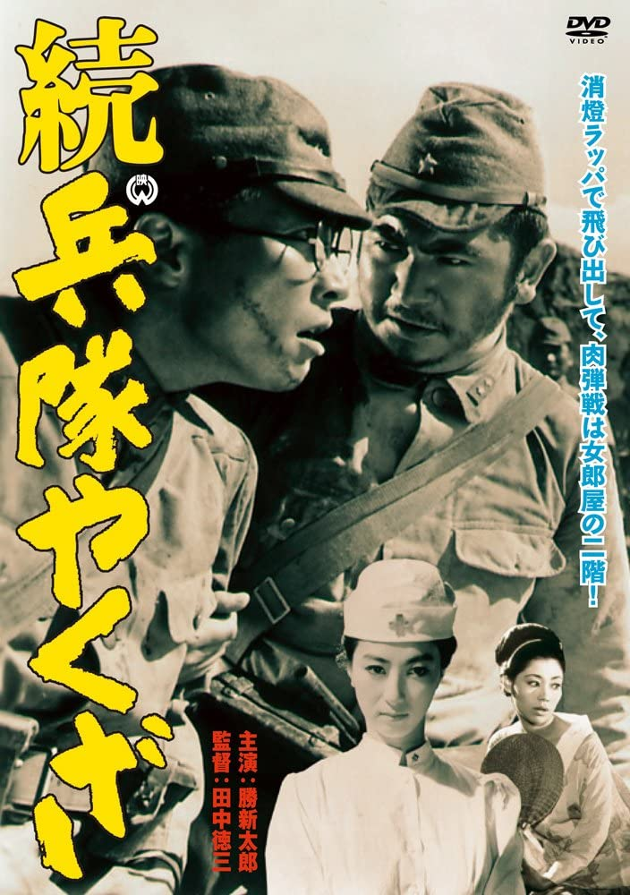

------

------

续军中黑道/続兵隊やくざ(Zoku Heitai Yakuza/Hoodlum Soldier and the C.O./Hoodlum Soldier 2) 是田中徳三于1965年导演，胜新太郎/田村高广主演的电影。是<军中黑道>系列的第2部作品。英文字幕由coralsundy自费出资，jls001999听译制作完成。有少许错漏和语句不够流畅，可全程完整欣赏电影，适用于01:31:20的版本。字幕仅供个人兴趣学习，不得商业化和付费。

------

Zoku Heitai Yakuza / Hoodlum Soldier and the C.O. / Hoodlum Soldier 2 (1965) is a 1965 movie directed by Tokuzo Tanaka, with notable stars Shintaro Katsu and Takahiro Tamura. This is the 2nd movie in the series.

------

**Translation/Subtitle**: jls001999 (jls001999@gmail.com) 
**Review/Proofreading**: coralsundy (coralsundy@gmail.com) 
*(Paid by coralsundy for the translation, personal use only)*

------

**中文字幕**: 尚无 
**English Subtitle**: [Zoku.Heitai.Yakuza.aka.Hoodlum.Soldier.2.1965.eng.01-31-20.BYjls001999.rev1.srt](../subtitles/Zoku.Heitai.Yakuza.aka.Hoodlum.Soldier.2.1965.eng.01-31-20.BYjls001999.rev1.srt)

  
**Heitai Yakuza / Hoodlum Soldier 1 subtitle**: <https://subhd.tv/a/530442> (Take from the internet I can remove it if the sub creator complains)

------

**SUBHD**: <https://subhd.tv/a/530443> 
**IMDB**: <https://www.imdb.com/title/tt0188305/> 
**DOUBAN**: <https://movie.douban.com/subject/20463161/>

------

**More Movie Subtitles on My Website**: <a href=''>CLICK HERE</a>

