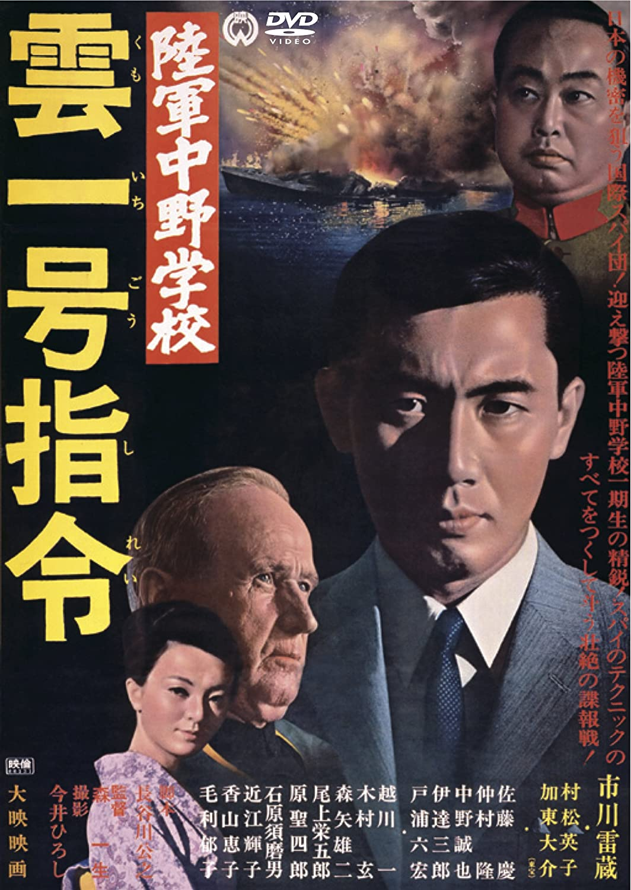

------

------

陆军中野学校·云一号指令 / 陸軍中野学校·雲一号指令 (Rikugun Nakano Gakko Kumoichigo Shirei / The School of Spies 2) 是森一生于1966年导演，市川雷藏/加东大介主演的电影。是<陆军中野学校>系列的第2部作品。英文字幕由coralsundy自费出资，jls001999听译制作完成。有少许错漏和语句不够流畅，可全程完整欣赏电影，适用于01:20:39的版本。字幕仅供个人兴趣学习，不得商业化和付费。

------

Rikugun Nakano Gakko Kumoichigo Shirei / The School of Spies 2 (1966) is a 1966 movie directed by Kazuo Mori, with notable stars Raizo Ichikawa and Daisuke Kato. This is the 2nd movie in The School of Spies Series.

------

**Translation/Subtitle**: jls001999 (jls001999@gmail.com) 
**Review/Proofreading**: coralsundy (coralsundy@gmail.com) 
*(Paid by coralsundy for the translation, personal use only)*

------

**中文字幕**: 尚无 
**English Subtitle**: [Rikugun.Nakano.Gakko.Kumoichigo.Shirei.aka.The.School.of.Spies.2.1966.eng.01-20-39.BYjls001999.rev1.srt](../subtitles/Rikugun.Nakano.Gakko.Kumoichigo.Shirei.aka.The.School.of.Spies.2.1966.eng.01-20-39.BYjls001999.rev1.srt)

  
**Rikugun Nakano Gakko / The School of Spies 1 subtitle**: <https://subhd.tv/a/530832> (Take from the internet I can remove it if the sub creator complains)

------

**SUBHD**: <https://subhd.tv/a/530833> 
**IMDB**: <https://www.imdb.com/title/tt0329540/> 
**DOUBAN**: <https://movie.douban.com/subject/25952927/>

------

**More Movie Subtitles on My Website**: <a href=''>CLICK HERE</a>

