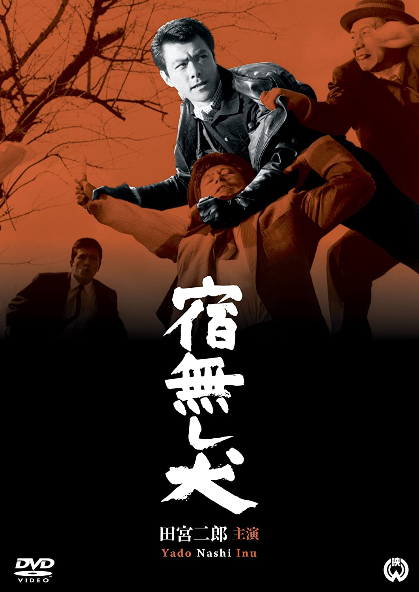

------

------

宿無し犬 (Yadonashi Inu / Homeless Dog) 是田中德三于1964年导演，田宫二郎主演的电影。是<犬>系列的第1部作品。英文字幕由coralsundy自费出资，jls001999听译制作完成。有少许错漏和语句不够流畅，可全程完整欣赏电影，适用于01:31:26的版本。

------

Yadonashi Inu / Homeless Dog (1964) is a 1964 movie directed by Tokuzo Tanaka, with notable stars Jiro Tamiya. This is the 1st movie in the Inu / Dog Series.

------

**Translation/Subtitle**: jls001999 (jls001999@gmail.com) 
**Review/Proofreading**: coralsundy (coralsundy@gmail.com) 
*(Paid by coralsundy for the translation, personal use only)*

------

**中文字幕**: 尚无 
**English Subtitle**: [Yadonashi.Inu.aka.Homeless.Dog.1964.eng.01-31-26.BYjls001999.rev1.srt](../subtitles/Yadonashi.Inu.aka.Homeless.Dog.1964.eng.01-31-26.BYjls001999.rev1.srt) 

------

**SUBHD**: <https://subhd.tv/a/531250> 
**IMDB**: <https://www.imdb.com/title/tt0328667/> 
**DOUBAN**: <https://movie.douban.com/subject/26987982/>

------

**More Movie Subtitles on My Website**: <a href=''>CLICK HERE</a>

