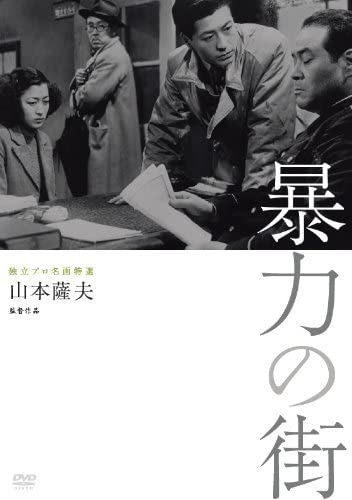

------

------

暴力の街 (Boryoku no Machi) 是山本萨夫于1950年执导，池部良/河野秋武/伊豆肇/三条美纪主演的电影。中文字幕由coralsundy自费出资，neola09听译制作。适用于01:50:56的版本。由于电影年代久远，音轨质量一般，听译难免错漏，敬请谅解。

------

**No English Subtitle**

------

**听译/字幕**: noela09 (noela1990@outlook.com) 
**审核/调整**: coralsundy (coralsundy@gmail.com) 
*(由coralsundy自费出资制作, 仅供个人学习)*

------

**中文字幕**: [Boryoku.no.Machi.aka.Street.of.Violence.1950.chs.01-50-56.BYnoela09.rev2.srt](../subtitles/Boryoku.no.Machi.aka.Street.of.Violence.1950.chs.01-50-56.BYnoela09.rev2.srt) 
**English Subtitle**: None

------

**SUBHD**: <https://subhd.tv/a/531418> 
**IMDB**: <https://www.imdb.com/title/tt1637711/> 
**DOUBAN**: <https://movie.douban.com/subject/5153272/>

------

**More Movie Subtitles on My Website**: <a href=''>CLICK HERE</a>

