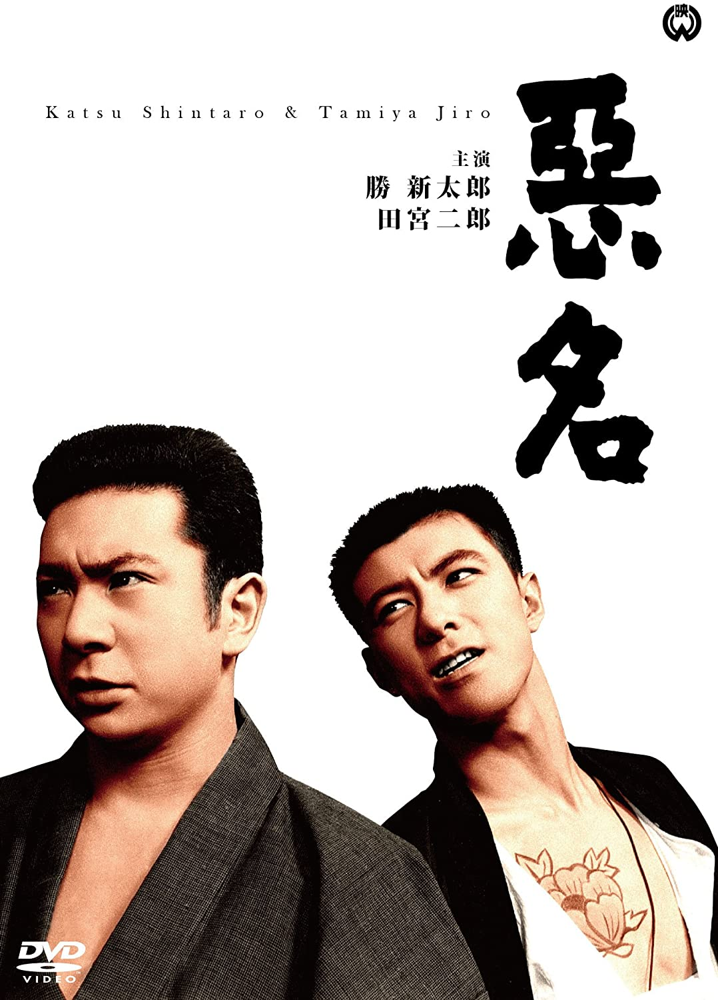

------

------

恶名/悪名 (Akumyo/Bad Reputation) 是田中德三于1961年导演， 胜新太郎/田宫二郎主演的电影。是<恶名>系列的第1部作品。英文字幕由coralsundy自费出资，jls001999听译制作完成。有少许错漏和语句不够流畅，可全程完整欣赏电影，适用于01:33:39的版本。

------

Akumyo / Bad Reputation (1961) is a 1961 movie directed by Tokuzo Tanaka, with notable stars Shintaro Katsu as well as Jiro Tamiya. This is the 1st movie in the Akumyo / Bad Reputation Series.

------

**Translation/Subtitle**: jls001999 (jls001999@gmail.com) 
**Review/Proofreading**: coralsundy (coralsundy@gmail.com) 
*(Paid by coralsundy for the translation, personal use only)*

------

**中文字幕**: 尚无 
**English Subtitle**: [Akumyo.aka.Bad.Reputation.1964.eng.01-33-39.BYjls001999.rev1.srt](../subtitles/Akumyo.aka.Bad.Reputation.1964.eng.01-33-39.BYjls001999.rev1.srt) 

------

**SUBHD**: <https://subhd.tv/a/531943> 
**IMDB**: <https://www.imdb.com/title/tt0122881/> 
**DOUBAN**: <https://movie.douban.com/subject/3536149/>

------

**More Movie Subtitles on My Website**: <a href=''>CLICK HERE</a>

