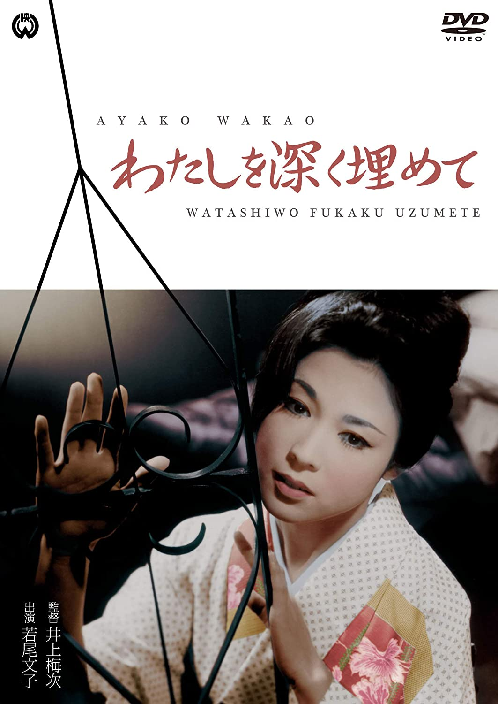

------

------

将我深埋 / わたしを深く埋めて (Bury Me Deep / Watashi o Fukaku Umete) 是井上梅次于1963年导演，田宫二郎 / 若尾文子主演的电影。英文字幕由coralsundy自费出资，jls001999听译制作完成。有少许错漏和语句不够流畅，可全程完整欣赏电影，适用于01:34:28的版本。

------

Watashi o Fukaku Umete / Bury Me Deep (1963) is a 1963 movie directed by Umetsugu Inoue, with notable stars Jiro Tamiya and Ayako Wakao. 

------

**Translation/Subtitle**: jls001999 (jls001999@gmail.com) 
**Review/Proofreading**: coralsundy (coralsundy@gmail.com) 
*(Paid by coralsundy for the translation, personal use only)*

------

**中文字幕**: 尚无 
**English Subtitle**: [Watashi.o.Fukaku.Umete.aka.Bury.Me.Deep.1963.eng.01-34-28.BYjls001999.rev1.srt](../subtitles/Watashi.o.Fukaku.Umete.aka.Bury.Me.Deep.1963.eng.01-34-28.BYjls001999.rev1.srt) 

------

**SUBHD**: <https://subhd.tv/a/532519> 
**IMDB**: <https://www.imdb.com/title/tt0384678/> 
**DOUBAN**: <https://movie.douban.com/subject/20418214/>

------

**More Movie Subtitles on My Website**: <a href=''>CLICK HERE</a>

