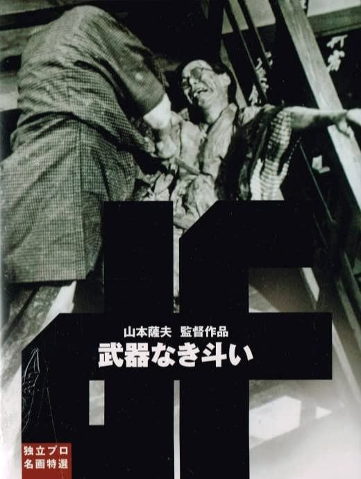

------

------

没有武器的战斗 / 武器なき斗い (The War Without Weapons / Buki Naki Tatakai) 是山本萨夫于1960年执导，下元勉/渡辺美佐子/東野英治郎主演的电影。中文字幕由coralsundy自费出资，neola09听译制作。适用于02:16:08的版本。由于电影年代久远，音轨质量一般，听译难免错漏，敬请谅解。

------

**No English Subtitle**

------

**听译/字幕**: noela09 (noela1990@outlook.com) 
**审核/调整**: coralsundy (coralsundy@gmail.com) 
*(由coralsundy自费出资制作, 仅供个人学习)*

------

**中文字幕**: [Buki.Naki.Tatakai.aka.The.War.Without.Weapons.1960.chs.02-16-08.BYnoela09.rev1.srt](../subtitles/Buki.Naki.Tatakai.aka.The.War.Without.Weapons.1960.chs.02-16-08.BYnoela09.rev1.srt) 
**English Subtitle**: None

------

**SUBHD**: <https://subhd.tv/a/532639> 
**IMDB**: <https://www.imdb.com/title/tt16160104/> 
**DOUBAN**: <https://movie.douban.com/subject/4149282/>

------

**More Movie Subtitles on My Website**: <a href=''>CLICK HERE</a>

