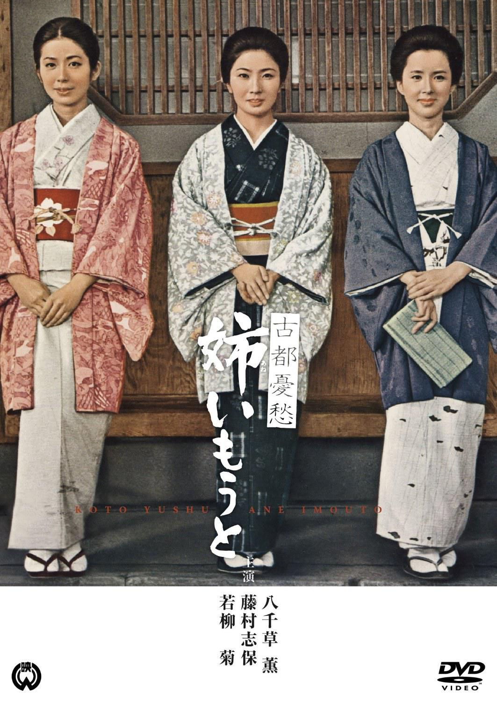

------

------

古都憂愁 姉いもうと (Koto Yushu Ane Imoto / The Sisters and I) 是三隅研次于1967年导演，藤村志保/八千草薰/船越英二主演的电影。英文字幕由coralsundy自费出资，jls001999听译制作完成。有少许错漏和语句不够流畅，可全程完整欣赏电影，适用于01:29:59的版本。

------

Koto Yushu Ane Imoto / The Sisters and I (1967) is a 1967 movie directed by Kenji Misumi, with notable stars Shiho Fujimura, Kaoru Yachigusa, and Eiji Funakoshi.

------

**Translation/Subtitle**: jls001999 (jls001999@gmail.com) 
**Review/Proofreading**: coralsundy (coralsundy@gmail.com) 
*(Paid by coralsundy for the translation, personal use only)*

------

**中文字幕**: 尚无 
**English Subtitle**: [Koto.Yushu.Ane.Imoto.aka.Sisters.1967.eng.01-29-59.BYjls001999.rev1.srt](../subtitles/Koto.Yushu.Ane.Imoto.aka.Sisters.1967.eng.01-29-59.BYjls001999.rev1.srt)

------

**SUBHD**: <https://subhd.tv/a/533059> 
**IMDB**: <https://www.imdb.com/title/tt5504370/> 
**DOUBAN**: <https://movie.douban.com/subject/26304951/>

------

**More Movie Subtitles on My Website**: <a href=''>CLICK HERE</a>

