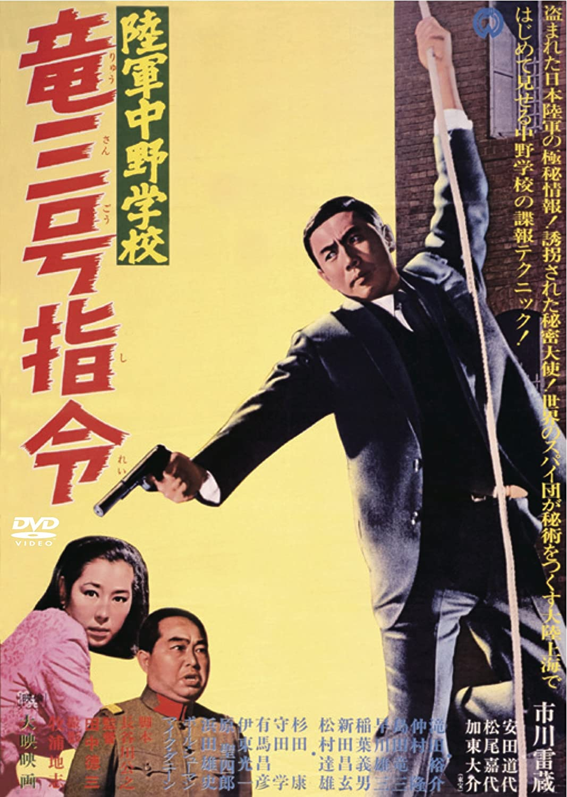

------

------

陆军中野学校龙三号指令 / 陸軍中野学校竜三号指令 (Rikugun Nakano Gakko Ryu Sango Shirei/The School of Spies 3) 是田中徳三于1967年导演，市川雷藏/加东大介主演的电影。是<陆军中野学校>系列的第3部作品。英文字幕由coralsundy自费出资，jls001999听译制作完成。有少许错漏和语句不够流畅，可全程完整欣赏电影，适用于01:28:11的版本。

------

Rikugun Nakano Gakko Ryu Sango Shirei / The School of Spies 3 (1967) is a 1967 movie directed by Kazuo Mori, with notable stars Raizo Ichikawa and Daisuke Kato. This is the 3rd movie in The School of Spies Series.

------

**Translation/Subtitle**: jls001999 (jls001999@gmail.com) 
**Review/Proofreading**: coralsundy (coralsundy@gmail.com) 
*(Paid by coralsundy for the translation, personal use only)*

------

**中文字幕**: 尚无 
**English Subtitle**: [Rikugun.Nakano.Gakko.Ryu.Sango.Shirei.aka.The.School.of.Spies.3.1967.eng.01-28-11.BYjls001999.rev1.srt](../subtitles/Rikugun.Nakano.Gakko.Ryu.Sango.Shirei.aka.The.School.of.Spies.3.1967.eng.01-28-11.BYjls001999.rev1.srt)

------

**SUBHD**: <https://subhd.tv/a/533607> 
**IMDB**: <https://www.imdb.com/title/tt0329542/> 
**DOUBAN**: <https://movie.douban.com/subject/25952938/>

------

**More Movie Subtitles on My Website**: <a href=''>CLICK HERE</a>

