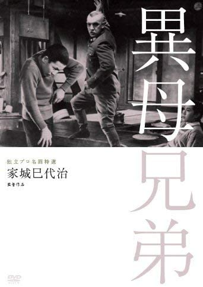

------

------

异母兄弟 / 異母兄弟 (Ibo Kyoudai / Stepbrothers) 是家城巳代治于1957年执导，三国连太郎/豊島八重子/田中绢代主演的电影。中文字幕由coralsundy自费出资，neola09听译制作。适用于01:50:31的版本。由于电影年代久远，音轨质量一般，听译难免错漏，敬请谅解。

------

**No English Subtitle**

------

**听译/字幕**: noela09 (noela1990@outlook.com) 
**审核/调整**: coralsundy (coralsundy@gmail.com) 
*(由coralsundy自费出资制作, 仅供个人学习)*

------

**中文字幕**: [Ibo.Kyoudai.aka.Stepbrothers.1957.chs.01-50-31.BYnoela09.rev1.srt](../subtitles/Ibo.Kyoudai.aka.Stepbrothers.1957.chs.01-50-31.BYnoela09.rev1.srt) 
**English Subtitle**: None

------

**SUBHD**: <https://subhd.tv/a/533910> 
**IMDB**: <https://www.imdb.com/title/tt0262478/> 
**DOUBAN**: <https://movie.douban.com/subject/3592518/>

------

**More Movie Subtitles on My Website**: <a href=''>CLICK HERE</a>

