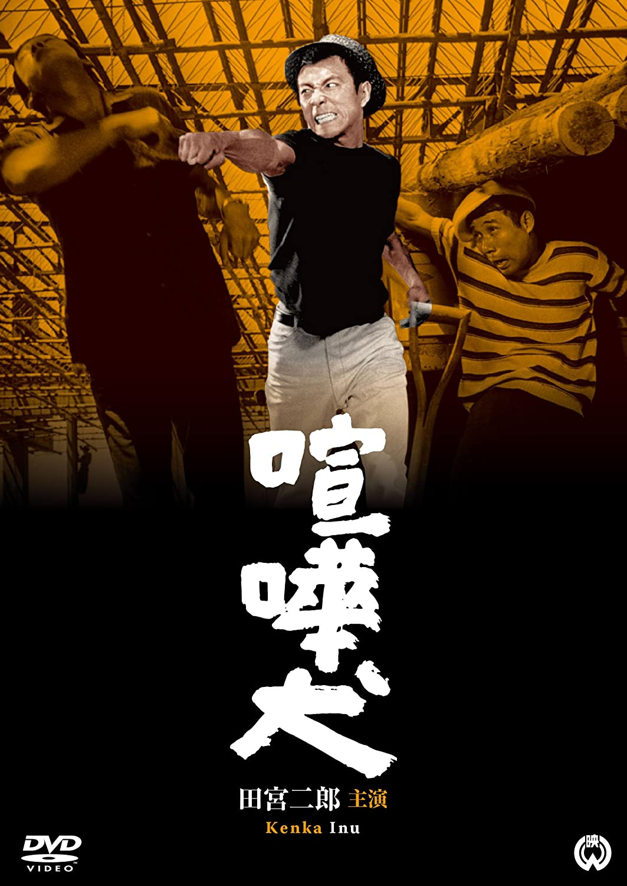

------

------

喧嘩犬 (Kenka Inu / Fighting Dog) 是村山三男于1964年导演，田宫二郎主演的电影。是<犬>系列的第2部作品。英文字幕由coralsundy自费出资，jls001999听译制作完成。有少许错漏和语句不够流畅，可全程完整欣赏电影，适用于01:29:05的版本。

------

Kenka Inu / Fighting Dog (1964) is a 1964 movie directed by Mitsuo Murayama, with notable stars Jiro Tamiya. This is the 2nd movie in the Inu / Dog Series.

------

**Translation/Subtitle**: jls001999 (jls001999@gmail.com) 
**Review/Proofreading**: coralsundy (coralsundy@gmail.com) 
*(Paid by coralsundy for the translation, personal use only)*

------

**中文字幕**: 尚无 
**English Subtitle**: [Kenka.Inu.aka.Fighting.Dog.1964.eng.01-29-05.BYjls001999.rev1.srt](../subtitles/Kenka.Inu.aka.Fighting.Dog.1964.eng.01-29-05.BYjls001999.rev1.srt)

------

**SUBHD**: <https://subhd.tv/a/535013> 
**IMDB**: <https://www.imdb.com/title/tt0328019/> 
**DOUBAN**: <https://movie.douban.com/subject/25812525/>

------

**More Movie Subtitles on My Website**: <a href=''>CLICK HERE</a>

