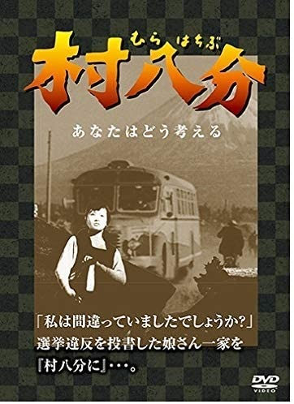

------

------

村八分 (Mura Hachibu) 是1953年今泉善珠监督，新藤兼人剧本，伊福部昭音乐，中原早苗/乙羽信子/山村聪合演的电影，改编自1952年日本静冈县上野村由于选举操控而导致的村八分真实事件。中文字幕由coralsundy自费出资，neola09听译制作。适用于01:35:16的30帧DVD版本。由于电影年代久远，音轨质量一般，听译难免错漏，敬请谅解。

------

**No English Subtitle**

------

**听译/字幕**: noela09 (noela1990@outlook.com) 
**审核/调整**: coralsundy (coralsundy@gmail.com) 
*(由coralsundy自费出资制作, 仅供个人学习)*

------

**中文字幕**: [Mura.Hachibu.1953.chs.01-35-16.BYnoela09.rev1.srt](../subtitles/Mura.Hachibu.1953.chs.01-35-16.BYnoela09.rev1.srt) 
**English Subtitle**: None

------

**SUBHD**: <https://subhd.tv/a/536644> 
**IMDB**: <https://www.imdb.com/title/tt0046104/> 
**DOUBAN**: <https://movie.douban.com/subject/26692529/>

------

**More Movie Subtitles on My Website**: <a href=''>CLICK HERE</a>

