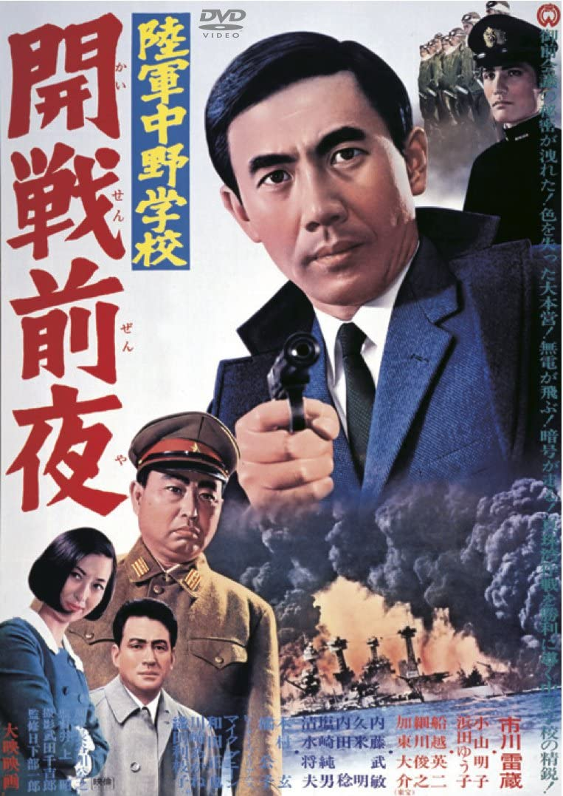

------

------

陆军中野学校·开战前夜 / 陸軍中野学校·開戦前夜 (Rikugun Nakano Gakko Kaisen Zenya / The School of Spies 5) 是井上昭于1968年导演，市川雷藏/加东大介主演的电影。是系列的第5部作品同时也是系列最后一部作品。次年，市川雷藏离世，系列就此终结。英文字幕由coralsundy自费出资，jls001999听译制作完成。有少许错漏和语句不够流畅，可全程完整欣赏电影，适用于01:28:48的版本。

------

Rikugun Nakano Gakko Kaisen Zenya / The School of Spies 5 (1968) is a 1968 movie directed by Akira Inoue, with notable stars Raizo Ichikawa and Daisuke Kato. This is the 5th and final movie in The School of Spies Series.

------

**Translation/Subtitle**: jls001999 (jls001999@gmail.com) 
**Review/Proofreading**: coralsundy (coralsundy@gmail.com) 
*(Paid by coralsundy for the translation, personal use only)*

------

**中文字幕**: 尚无 
**English Subtitle**: [Rikugun.Nakano.Gakko.Kaisen.Zenya.aka.The.School.of.Spies.5.1968.eng.01-28-48.BYjls001999.rev1.srt](../subtitles/Rikugun.Nakano.Gakko.Kaisen.Zenya.aka.The.School.of.Spies.5.1968.eng.01-28-48.BYjls001999.rev1.srt)

------

**SUBHD**: <https://subhd.tv/a/537075> 
**IMDB**: <https://www.imdb.com/title/tt0294876/> 
**DOUBAN**: <https://movie.douban.com/subject/5132368/>

------

**More Movie Subtitles on My Website**: <a href=''>CLICK HERE</a>

