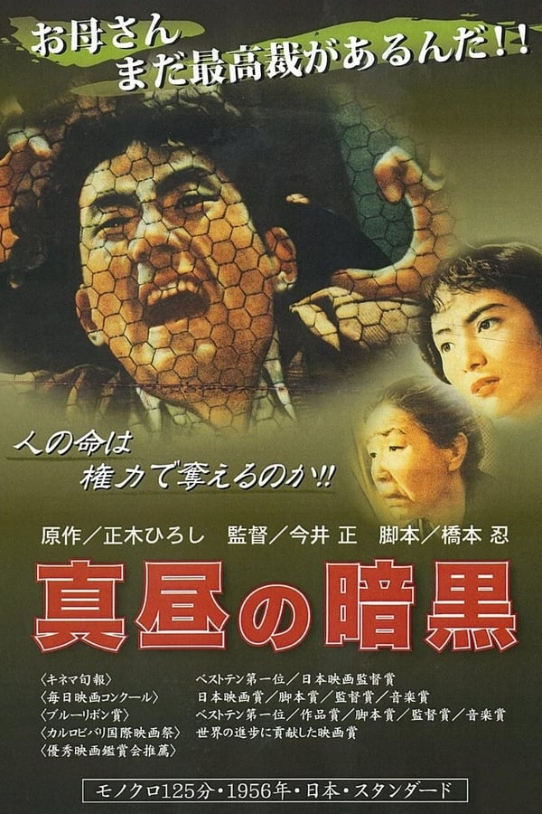

------

------

正午的黑暗 / 真昼の暗黒 (Mahiru no Ankoku / Darkness at Noon) 是1956年今井正监督，桥本忍剧本，伊福部昭音乐，草薙幸二郎/松山照夫/左幸子合演的电影，改编自1951年山口县熊毛郡麻郷村八海的强盗杀人事件(原小说作者为正木ひろし)。中文字幕由coralsundy自费出资，根据豆瓣网友Maverick翻译的中文剧本为基础，由neola09听译校对制作。适用于02:03:49的版本(30帧)。由于电影年代久远，音轨质量一般，听译难免错漏，敬请谅解。字幕仅供个人兴趣学习，不得商业化和付费。如有其他字幕翻译是基于我提供的字幕，敬请标明出处。

------

**No English Subtitle**

------

**听译/字幕**: noela09 (noela1990@outlook.com) 
**审核/调整**: coralsundy (coralsundy@gmail.com) 
*(由coralsundy自费出资制作, 仅供个人学习)*

------

**中文字幕**: [Mahiru.no.Ankoku.aka.Darkness.at.Noon.1956.chs.02-04-49.BYnoela09.rev1.srt](../subtitles/Mahiru.no.Ankoku.aka.Darkness.at.Noon.1956.chs.02-04-49.BYnoela09.rev1.srt) 
**English Subtitle**: None

------

**SUBHD**: <https://subhd.tv/a/538385> 
**IMDB**: <https://www.imdb.com/title/tt0049464/> 
**DOUBAN**: <https://movie.douban.com/subject/1547206/>

------

**More Movie Subtitles on My Website**: <a href=''>CLICK HERE</a>

