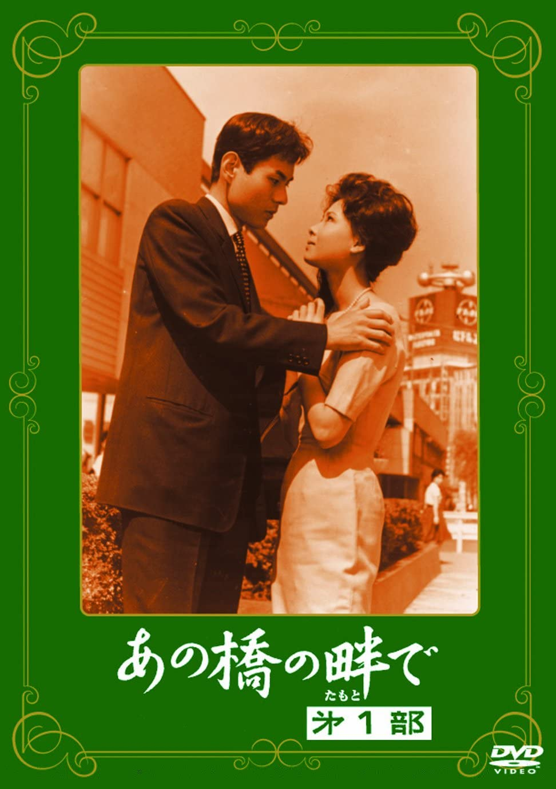

------

------

在那座桥的岸边·第一部 / あの橋の畔で·第一部 (Ano Hashi no Hotori de / At the Side of the Bridge) 是野村芳太郎于1962年导演，野村芳太郎/山田洋次/岡田教和共同脚本，桑野美雪/园井啓介主演的电影。是<あの橋の畔で>系列的第1部作品。英文字幕由coralsundy自费出资，邀请一位不愿透露姓名的日本译者，听译制作完成，可全程完整欣赏电影，适用于01:32:08的版本。

------

Ano Hashi no Hotori de / At the Side of the Bridge (1962) is a 1962 movie directed by Yoshitaro Nomura, script by Yoshitaro Nomura/Yoji Yamada/Yoshikazu Okada, with notable stars Miyuki Kuwano and Keisuke Sonoi. This is the 1st movie in the At the Side of the Bridge Series.

------

**Translation/Subtitle**: Translator requests anonymity 
**Review/Proofreading**: coralsundy (coralsundy@gmail.com) 
*(Paid by coralsundy for the translation, personal use only)*

------

**中文字幕**: 尚无 
**English Subtitle**: [Ano.Hashi.no.Hotori.de.aka.At.the.Side.of.the.Bridge.1962.eng.BYcoralsundy.rev1.srt](../subtitles/Ano.Hashi.no.Hotori.de.aka.At.the.Side.of.the.Bridge.1962.eng.BYcoralsundy.rev1.srt)

------

**SUBHD**: <https://subhd.tv/a/538730> 
**IMDB**: None 
**DOUBAN**: <https://movie.douban.com/subject/26589469/>

------

**More Movie Subtitles on My Website**: <a href=''>CLICK HERE</a>

