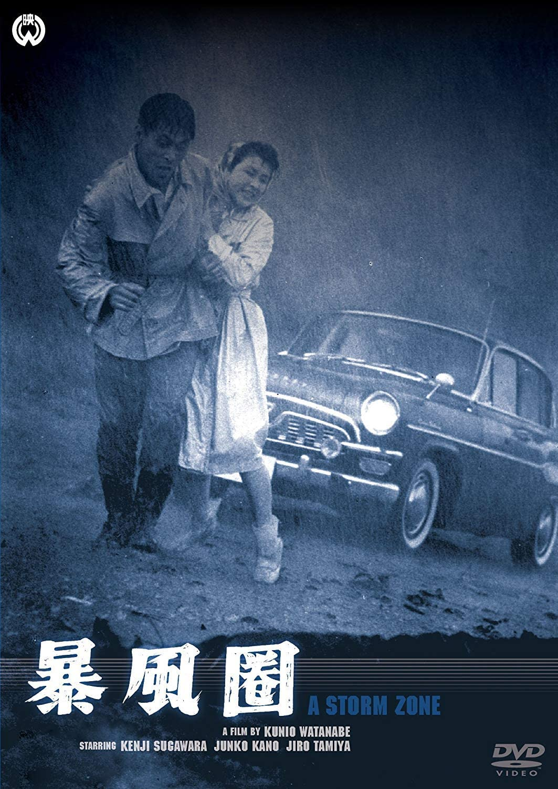

------

------

暴风圈 / 暴風圏 (Bofuken) 是1959年渡辺邦男监督，渡辺邦男/松浦健郎合作剧本，山田荣一音乐，叶順子主演的电影。中文字幕由coralsundy自费出资，neola09听译制作。适用于01:38:23的版本。由于电影年代久远，音轨质量一般，听译难免错漏，敬请谅解。

------

**No English Subtitle**

------

**听译/字幕**: noela09 (noela1990@outlook.com) 
**审核/调整**: coralsundy (coralsundy@gmail.com) 
*(由coralsundy自费出资制作, 仅供个人学习)*

------

**中文字幕**: [Bofuken.1959.chs.01-38-23.BYnoela09.rev1.srt](../subtitles/Bofuken.1959.chs.01-38-23.BYnoela09.rev1.srt) 
**English Subtitle**: None

------

**SUBHD**: <https://subhd.tv/a/539366> 
**IMDB**: <https://www.imdb.com/title/tt3066602/> 
**DOUBAN**: <https://movie.douban.com/subject/26864363/>

------

**More Movie Subtitles on My Website**: <a href=''>CLICK HERE</a>

