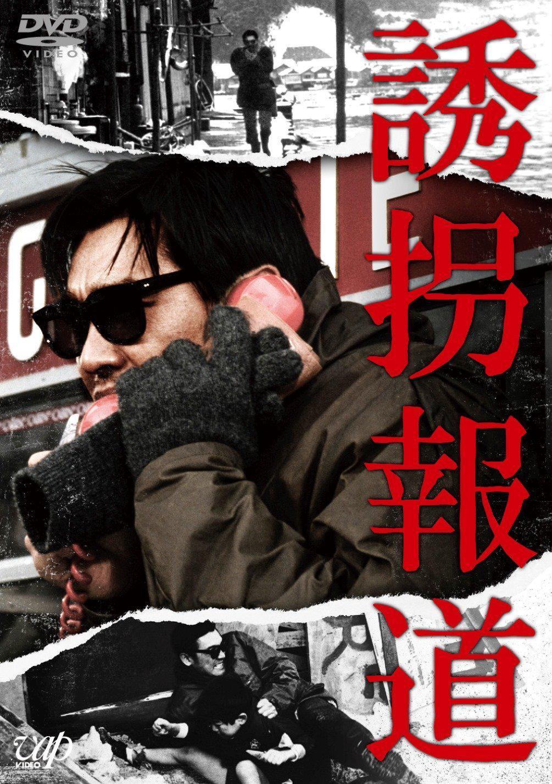

------

------

诱拐报道/誘拐報道 (Yukai Hodo/To Trap a Kidnapper) 是1982年伊藤俊也监督，松田宽夫剧本，菊池俊辅音乐，萩原健一 / 小柳留美子 / 秋吉久美子主演的电影，改编自1980年宝冢市学童诱拐事件(基于读卖新闻大阪总部社会事务科编辑的同名纪录片)。中文字幕由coralsundy根据现有的英文字幕翻译而成，同时采用日文字幕校对。适用于02:14:22的版本。由于译者本人对日语不够精通，校对难免错漏，敬请谅解。

------

Yukai Hodo / To Trap a Kidnapper (1982) is a 1982 movie directed by Shunya Ito, based on a 1980 true kidnapping case happened in Takarazuka, Japan, with notable stars Kenichi Hagiwara, Rumiko Koyanagi, and Rumiko Koyanagi.

------

**字幕/校对**: coralsundy (coralsundy@gmail.com) 
**审核/调整**: coralsundy (coralsundy@gmail.com) 
*(中字由coralsundy根据英字翻译，日字校对，仅供学习)*

------

**中文字幕**: [Yukai.Hodo.aka.To.Trap.a.Kidnapper.1982.chs.02-14-22.BYcoralsundy.rev1.srt](../subtitles/Yukai.Hodo.aka.To.Trap.a.Kidnapper.1982.chs.02-14-22.BYcoralsundy.rev1.srt) 
The Chinese movie subtitle is based on the English subtitle found online, with tweaks and improvements based on the Japanese subtitle.  
**English Subtitle**: [Yukai.Hodo.aka.To.Trap.a.Kidnapper.1982.eng.srt](../subtitles/Yukai.Hodo.aka.To.Trap.a.Kidnapper.1982.eng.srt) 
If contacted by the owner of the English subtitle, I will take it off my site. 

------

**SUBHD**: <https://subhd.tv/a/541519> 
**IMDB**: <https://www.imdb.com/title/tt0128766/> 
**DOUBAN**: <https://movie.douban.com/subject/2222683/>

------

**More Movie Subtitles on My Website**: <a href=''>CLICK HERE</a>

