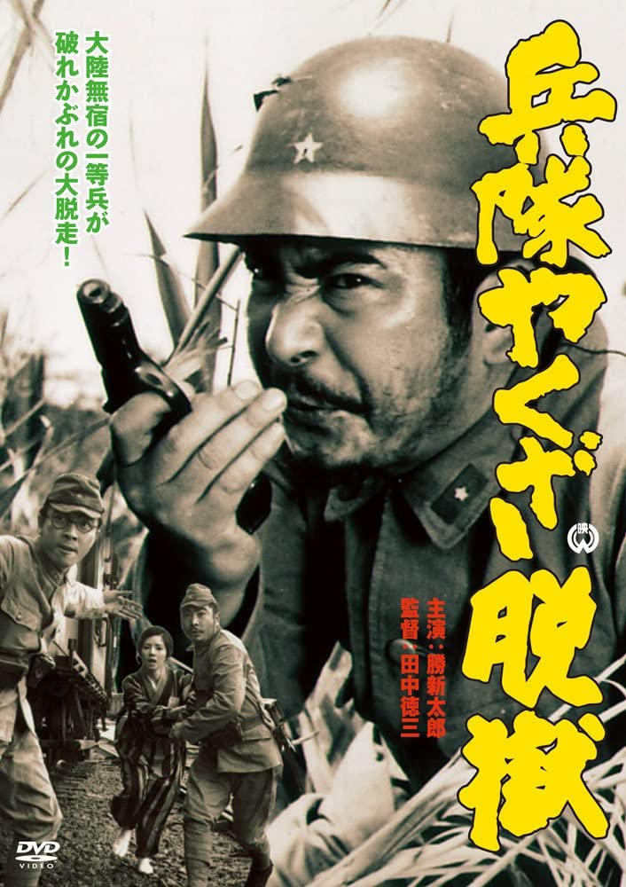

------

------

军中黑道越狱/兵隊やくざ脱獄 (Heitai Yakuza Datsugoku/Hoodlum Soldier's Escape/Hoodlum Soldier 4) 是森一生于1966年导演，胜新太郎/田村高广主演的电影。是系列的第4部作品。英文字幕由coralsundy自费出资，jls001999听译制作完成。有少许错漏和语句不够流畅，可全程完整欣赏电影，适用于01:25:48的版本。
 
 
*注：早期DVD海报上，把导演森一生写成了田中德三。*

------

Heitai Yakuza Datsugoku / Hoodlum Soldier 4 (1966) is a 1966 movie directed by Kazuo Mori, with notable stars Shintaro Katsu and Takahiro Tamura. This is the 4th movie in the series.
 
 
*Note: The early versions of DVDs mistakenly have Tokuzo Tanaka as the director instead of Kazuo Mori.*

------

**Translation/Subtitle**: jls001999 (jls001999@gmail.com) 
**Review/Proofreading**: coralsundy (coralsundy@gmail.com) 
*(Paid by coralsundy for the translation, personal use only)*

------

**中文字幕**: 尚无 
**English Subtitle**: [Heitai.Yakuza.Datsugoku.aka.Hoodlum.Soldier.4.1966.eng.01-25-48.BYjls001999.rev1.srt](../subtitles/Heitai.Yakuza.Datsugoku.aka.Hoodlum.Soldier.4.1966.eng.01-25-48.BYjls001999.rev1.srt)

------

**SUBHD**: <https://subhd.tv/a/541655> 
**IMDB**: <https://www.imdb.com/title/tt0228376/> 
**DOUBAN**: <https://movie.douban.com/subject/20463168/>

------

**More Movie Subtitles on My Website**: <a href=''>CLICK HERE</a>

