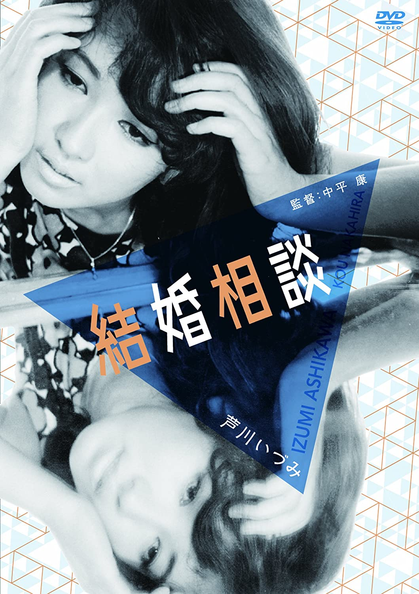

------

------

结婚相谈 / 結婚相談 (Kekkon Sodan / The Passionate Spinster / Marriage Counseling) 是中平康于1965年导演，改编自圆地文子的同名小说，须藤胜人脚本，伊部晴美音乐，芦川泉 / 山本阳子 / 中尾彬主演的电影。英文字幕由coralsundy自费出资，由jls001999听译制作完成。有少许错漏和语句不够流畅，可全程完整欣赏电影，适用于01:44:49的版本。

------

Kekkon Sodan aka The Passionate Spinster / Marriage Counseling (1965) is a 1965 movie directed by Ko Nakahira, with notable stars Izumi Ashikawa, Yoko Yamamoto, and Akira Nakao.

------

**Translation/Subtitle**: jls001999 (jls001999@gmail.com) 
**Review/Proofreading**: coralsundy (coralsundy@gmail.com) 
*(Paid by coralsundy for the translation, personal use only)*

------

**中文字幕**: 尚无 
**English Subtitle**: [Kekkon.Sodan.aka.The.Passionate.Spinster.1965.eng.01-44-49.BYjls001999.rev2.srt](../subtitles/Kekkon.Sodan.aka.The.Passionate.Spinster.1965.eng.01-44-49.BYjls001999.rev2.srt)

------

**SUBHD**: <https://subhd.tv/a/542137> 
**IMDB**: <https://www.imdb.com/title/tt3055398/> 
**DOUBAN**: <https://movie.douban.com/subject/25833092/>

------

**More Movie Subtitles on My Website**: <a href=''>CLICK HERE</a>

