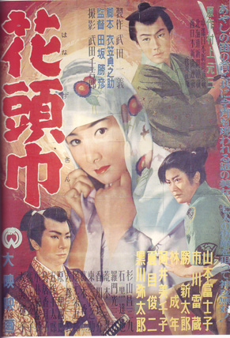

------

------

花头巾 / 花頭巾 (Hana Zukin / The Flowery Hood) 是1956年田坂勝彦监督，村上元三原作，衣笠贞之助剧本，渡边浦人音乐，市川雷藏 / 山本富士子 / 胜新太郎主演的电影，是《花头巾》两部曲的上集。中文字幕由coralsundy自费出资，neola09听译制作。适用于01:23:31的版本。由于电影年代久远，音轨质量一般，听译难免错漏，敬请谅解。

------

**No English Subtitle**

------

**听译/字幕**: noela09 (noela1990@outlook.com) 
**审核/调整**: coralsundy (coralsundy@gmail.com) 
*(由coralsundy自费出资制作, 仅供个人学习)*

------

**中文字幕**: [Hana.Zukin.aka.The.Flowery.Hood.1956.chs.01-23-31.BYnoela09.rev1.srt](../subtitles/Hana.Zukin.aka.The.Flowery.Hood.1956.chs.01-23-31.BYnoela09.rev1.srt) 
**English Subtitle**: None

------

**SUBHD**: <https://subhd.tv/a/542651> 
**IMDB**: <https://www.imdb.com/title/tt10342618/> 
**DOUBAN**: <https://movie.douban.com/subject/36053129/>

------

**More Movie Subtitles on My Website**: <a href=''>CLICK HERE</a>

