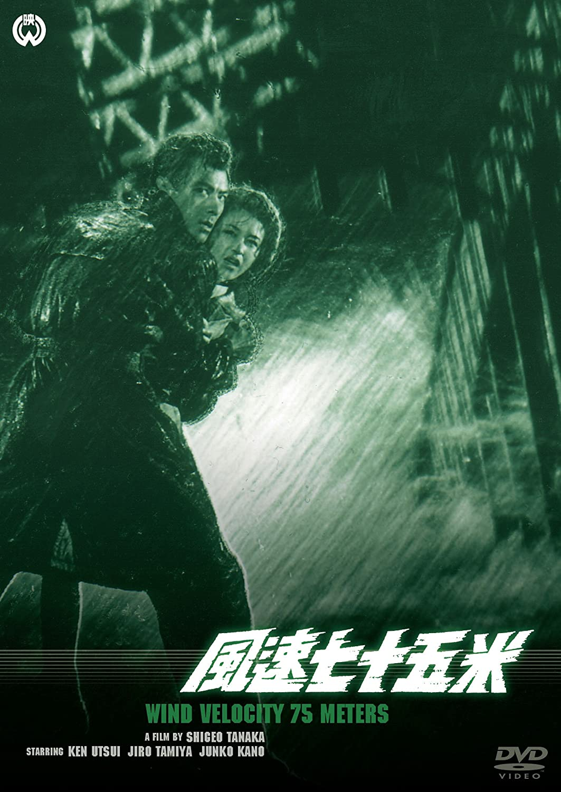

------

------

风速七十五米 / 風速七十五米 (Fusoku Nanaju-go Metoru / Typhoon Reporter) 是田中重雄于1963年导演，高岩肇 / 田口耕三合作脚本，木下忠司音乐，宇津井健 / 田宫二郎 / 叶顺子主演的电影，也是叶顺子演员生涯最后一部作品。由于当时彩色摄影需要高瓦数的照明，叶顺子的眼睛出现问题，诊断表明如果继续进行高光照摄影，有可能会造成失明，因此这部电影之后她就退出了影坛。英文字幕由coralsundy自费出资，由jls001999听译制作完成。有少许错漏和语句不够流畅，可全程完整欣赏电影，适用于01:28:27的版本。

------

Fusoku Nanaju-go Metoru aka Typhoon Reporter (1963) is a 1963 movie directed by Shigeo Tanaka, with notable stars Ken Utsui, Jiro Tamiya, Junko Kano. This is Junko Kano's last movie of her career.
 
 
**Based on Wikipedia**:
 
*"According to Hidemasa Nagata, the director of photography, color photography at that time required 600 to 800 watts of lighting when taking close-ups of the face, and after a series of these types of shots, the edges of her eyes became abnormal, and the medical office determined that she would go blind if the lighting continued, leading to her retirement."*

------

**Translation/Subtitle**: jls001999 (jls001999@gmail.com) 
**Review/Proofreading**: coralsundy (coralsundy@gmail.com) 
*(Paid by coralsundy for the translation, personal use only)*

------

**中文字幕**: 尚无 
**English Subtitle**: [Fusoku.Nanaju-go.Metoru.aka.Typhoon.Reporter.1963.eng.01-28-27.BYjls001999.rev1.srt](../subtitles/Fusoku.Nanaju-go.Metoru.aka.Typhoon.Reporter.1963.eng.01-28-27.BYjls001999.rev1.srt)

------

**SUBHD**: <https://subhd.tv/a/542963> 
**IMDB**: <https://www.imdb.com/title/tt6867610/> 
**DOUBAN**: <https://movie.douban.com/subject/36148214/>

------

**More Movie Subtitles on My Website**: <a href=''>CLICK HERE</a>

