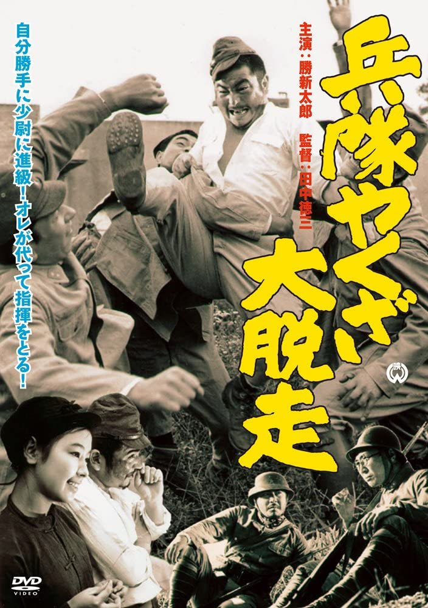

------

------

军中黑道大逃亡 / 兵隊やくざ大脱走 (Heitai Yakuza Daidasso / Hoodlum Soldier's Flight to Freedom / Hoodlum Soldier 5) 是田中德三于1966年导演，胜新太郎/田村高广主演的电影。是系列的第5部作品。英文字幕由coralsundy自费出资，jls001999听译制作完成。有少许错漏和语句不够流畅，可全程完整欣赏电影，适用于01:27:59的版本。

------

Heitai Yakuza Daidasso / Hoodlum Soldier's Flight to Freedom aka Hoodlum Soldier 5 (1966) is a 1966 movie directed by Tokuzo Tanaka, with notable stars Shintaro Katsu and Takahiro Tamura. This is the 5th movie in the series.

------

**Translation/Subtitle**: jls001999 (jls001999@gmail.com) 
**Review/Proofreading**: coralsundy (coralsundy@gmail.com) 
*(Paid by coralsundy for the translation, personal use only)*

------

**中文字幕**: 尚无 
**English Subtitle**: [Heitai.Yakuza.Daidasso.aka.Hoodlum.Soldiers.Flight.to.Freedom.1966.eng.01-27-59.BYjls001999.rev1.srt](../subtitles/Heitai.Yakuza.Daidasso.aka.Hoodlum.Soldiers.Flight.to.Freedom.1966.eng.01-27-59.BYjls001999.rev1.srt)

------

**SUBHD**: <https://subhd.tv/a/542998> 
**IMDB**: <https://www.imdb.com/title/tt0228375/> 
**DOUBAN**: <https://movie.douban.com/subject/20445437/>

------

**More Movie Subtitles on My Website**: <a href=''>CLICK HERE</a>

