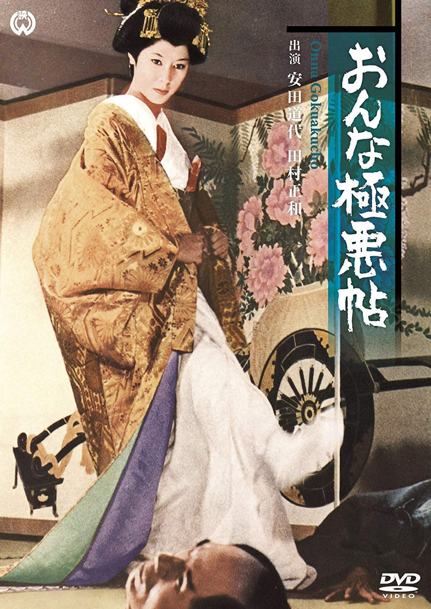

------

------

女人的极恶贴 / おんな極悪帖 (Onna Gokuakucho / Naked Ambition) 是池广一夫于1970年导演，基于谷崎润一郎《恐怖时代》原作改编，星川清司脚本，渡边岳夫音乐，田村正和 / 安田道代主演的电影。此片全员恶人，是池广一夫自认为最喜欢的两部作品之一(另一部是《一匹狼》)。英文字幕由coralsundy自费出资，jls001999听译制作完成。有少许错漏和语句不够流畅，可全程完整欣赏电影，适用于01:24:00的版本。

------

Onna Gokuakucho / Naked Ambition (1970) is a 1970 movie directed by Kazuo Ikehiro, with notable stars Masakazu Tamura and Michiyo Yasuda (Michiyo Ookusu). It is based on a story by Jun'ichirō Tanizaki, with a setup that every character in the story is a villain. The movie is also being considered as one of the best movies in the director's career.

------

**Translation/Subtitle**: jls001999 (jls001999@gmail.com) 
**Review/Proofreading**: coralsundy (coralsundy@gmail.com) 
*(Paid by coralsundy for the translation, personal use only)*

------

**中文字幕**: 尚无 
**English Subtitle**: [Onna.Gokuakucho.aka.Naked.Ambition.1970.eng.01-24-00.BYjls001999.rev1.srt](../subtitles/Onna.Gokuakucho.aka.Naked.Ambition.1970.eng.01-24-00.BYjls001999.rev1.srt)

------

**SUBHD**: <https://subhd.tv/a/543657> 
**IMDB**: <https://www.imdb.com/title/tt0198872/> 
**DOUBAN**: <https://movie.douban.com/subject/21327508/>

------

**More Movie Subtitles on My Website**: <a href=''>CLICK HERE</a>

