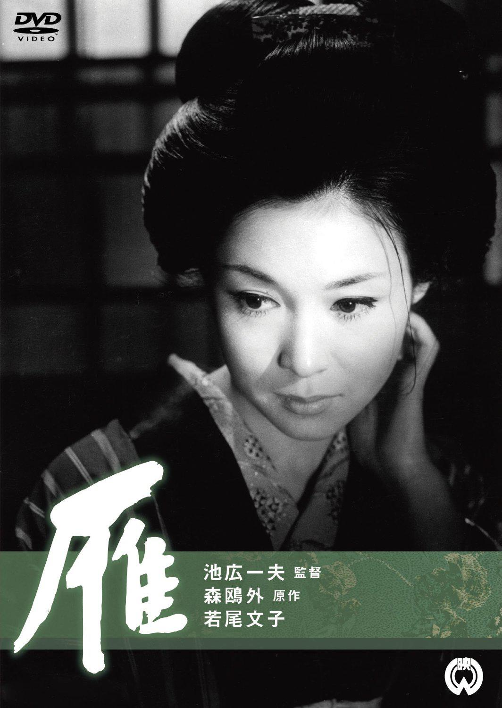

------

------

雁 (Gan / The Wild Goose) 是1966年池广一夫监督，森鸥外原作，成泽昌茂剧本，池野成音乐，若尾文子 / 小泽荣太郎主演的电影。中文字幕由coralsundy自费出资，neola09听译制作。适用于01:26:50的版本。由于电影年代久远，音轨质量一般，听译难免错漏，敬请谅解。

------

**No English Subtitle**

------

**听译/字幕**: noela09 (noela1990@outlook.com) 
**审核/调整**: coralsundy (coralsundy@gmail.com) 
*(由coralsundy自费出资制作, 仅供个人学习)*

------

**中文字幕**: [Gan.aka.The.Wild.Goose.1966.chs.01-26-50.BYnoela09.rev1.srt](../subtitles/Gan.aka.The.Wild.Goose.1966.chs.01-26-50.BYnoela09.rev1.srt) 
**English Subtitle**: None

------

**SUBHD**: <https://subhd.tv/a/544311> 
**IMDB**: <https://www.imdb.com/title/tt0260919/> 
**DOUBAN**: <https://movie.douban.com/subject/3011448/>

------

**More Movie Subtitles on My Website**: <a href=''>CLICK HERE</a>

