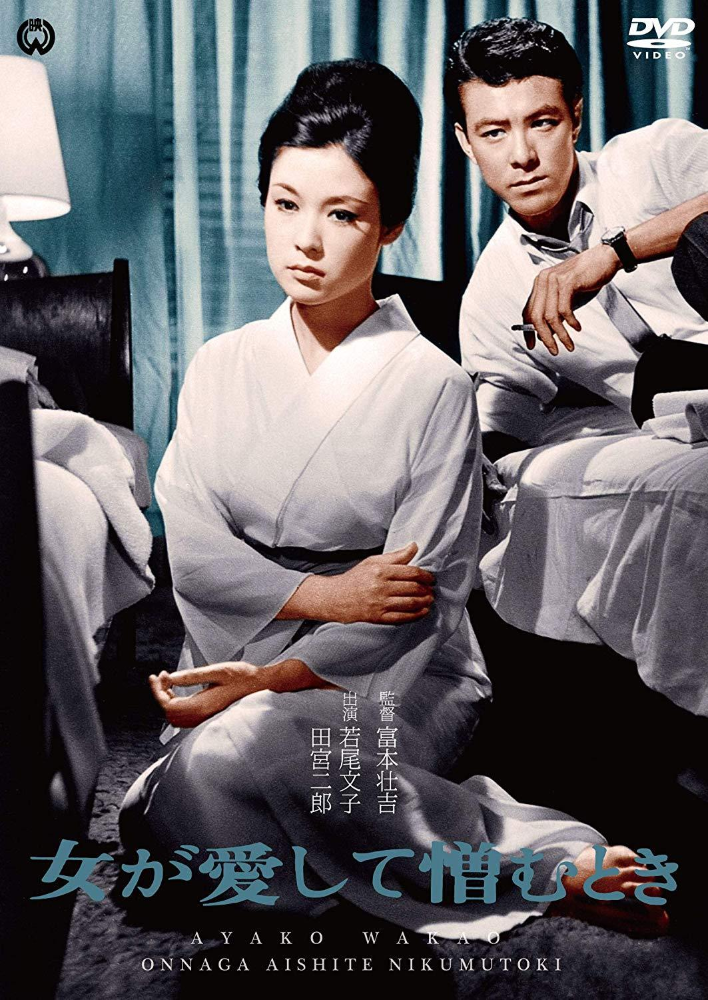

------

------

当女人又爱又恨 / 女が愛して憎むとき (Onna Ga Aishite Nikumu Toki / She Came for Love) 是富本壮吉于1963年导演，菊岛隆三脚本，伊部晴美音乐，田宫二郎 / 若尾文子主演的电影。英文字幕由coralsundy自费出资，jls001999听译制作完成。有少许错漏和语句不够流畅，可全程完整欣赏电影，适用于01:28:07的版本。

------

Onna Ga Aishite Nikumu Toki / She Came for Love (1963) is a 1963 movie directed by Sokichi Tomimoto, with notable stars Jiro Tamiya and Ayako Wakao.

------

**Translation/Subtitle**: jls001999 (jls001999@gmail.com) 
**Review/Proofreading**: coralsundy (coralsundy@gmail.com) 
*(Paid by coralsundy for the translation, personal use only)*

------

**中文字幕**: 尚无 
**English Subtitle**: [Onna.Ga.Aishite.Nikumu.Toki.aka.She.Came.for.Love.1963.eng.01-28-07.BYjls001999.rev1.srt](../subtitles/Onna.Ga.Aishite.Nikumu.Toki.aka.She.Came.for.Love.1963.eng.01-28-07.BYjls001999.rev1.srt)

------

**SUBHD**: <https://subhd.tv/a/545206> 
**IMDB**: <https://www.imdb.com/title/tt0256980/> 
**DOUBAN**: <https://movie.douban.com/subject/26687341/>

------

**More Movie Subtitles on My Website**: <a href=''>CLICK HERE</a>

