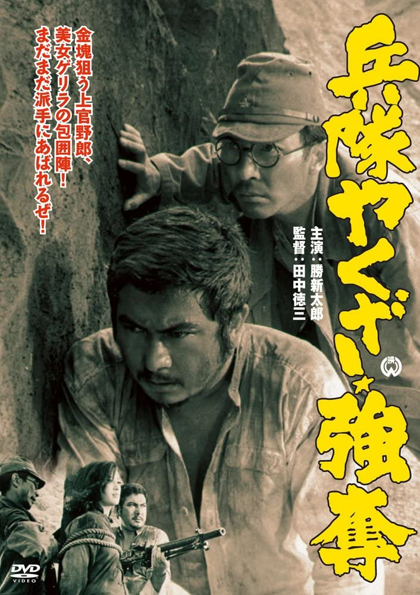

------

------

军中黑道强夺 / 兵隊やくざ 強奪 (Heitai Yakuza Godatsu / Hoodlum Soldier Looting.and.Pillaging / Hoodlum Soldier 8) 是田中德三于1968年导演，胜新太郎/田村高广主演的电影。是系列的第8部作品，也是最后一部60年代的黑白电影作品，随后的《新军中黑道火线 / 新兵隊やくざ 火線 (1972)》是70年代的彩色电影，算是系列的完结作。英文字幕由coralsundy自费出资，jls001999听译制作完成。有少许错漏和语句不够流畅，可全程完整欣赏电影，适用于01:16:43的版本。

------

Heitai Yakuza Nagurikomi aka Hoodlum Soldier 8 (1968) is a 1968 movie directed by Tokuzo Tanaka, with notable stars Shintaro Katsu and Takahiro Tamura. This is the 8th movie in the series, and the final installment in the 1960s. The last movie of the series "New Hoodlum Soldier Story Firing Line" was released in 1972.

------

**Translation/Subtitle**: jls001999 (jls001999@gmail.com) 
**Review/Proofreading**: coralsundy (coralsundy@gmail.com) 
*(Paid by coralsundy for the translation, personal use only)*

------

**中文字幕**: 尚无 
**English Subtitle**: [Heitai.Yakuza.Godatsu.aka.Hoodlum.Soldier.Looting.and.Pillaging.1968.eng.01-19-43.BYjls001999.rev1.srt](../subtitles/Heitai.Yakuza.Godatsu.aka.Hoodlum.Soldier.Looting.and.Pillaging.1968.eng.01-19-43.BYjls001999.rev1.srt)

------

**SUBHD**: <https://subhd.tv/a/545974> 
**IMDB**: <https://www.imdb.com/title/tt0228377/> 
**DOUBAN**: <https://movie.douban.com/subject/20463146/>

------

**More Movie Subtitles on My Website**: <a href=''>CLICK HERE</a>

