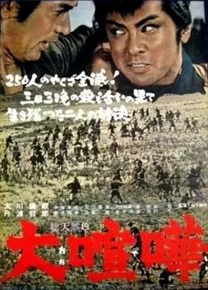

------

------

大喧哗 / 大喧嘩 (Odeiri / Giant Rumble) 是山下耕作于1964年导演，村尾昭 / 铃木则文 / 中岛贞夫共同脚本，木下忠司音乐，大川桥蔵 / 十朱幸代 / 加藤嘉主演的电影。英文字幕由coralsundy自费出资，jls001999听译制作完成。有少许错漏和语句不够流畅，可全程完整欣赏电影，适用于01:33:40的版本。

------

Odeiri / Giant Rumble (1964) is a 1964 movie directed by Kosaku Yamashita, with notable stars Hashizo Okawa, Yukiyo Toake, and Yoshi Kato.

------

**Translation/Subtitle**: jls001999 (jls001999@gmail.com) 
**Review/Proofreading**: coralsundy (coralsundy@gmail.com) 
*(Paid by coralsundy for the translation, personal use only)*

------

**中文字幕**: 尚无 
**English Subtitle**: [Odeiri.aka.Giant.Rumble.1964.eng.01-33-40.BYjls001999.rev1.srt](../subtitles/Odeiri.aka.Giant.Rumble.1964.eng.01-33-40.BYjls001999.rev1.srt)

------

**SUBHD**: <https://subhd.tv/a/546398> 
**IMDB**: <https://www.imdb.com/title/tt0329799/> 
**DOUBAN**: <https://movie.douban.com/subject/5124443/>

------

**More Movie Subtitles on My Website**: <a href=''>CLICK HERE</a>

