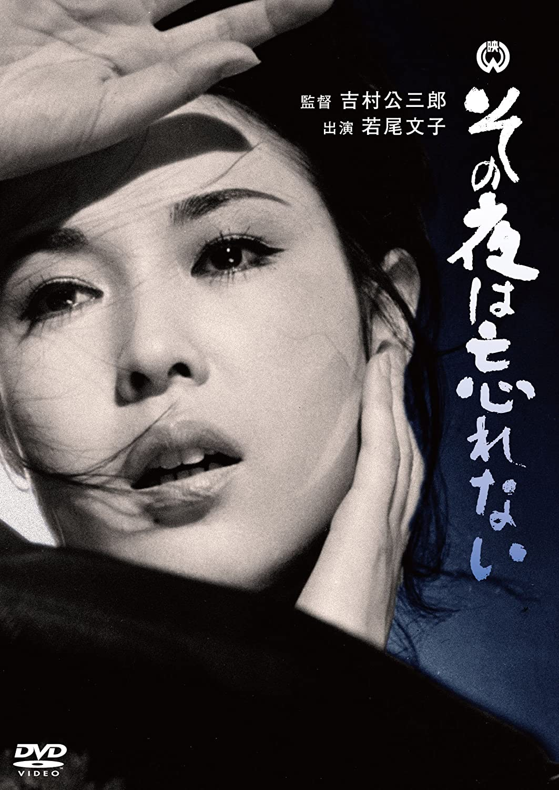

------

------

无法忘怀的那夜 / その夜は忘れない (Sono Yo Wa Wasurenai / A Night to Remember) 是吉村公三郎于1962年导演，白井更生 / 若尾德平共同脚本，团伊玖磨音乐，田宫二郎 / 若尾文子 / 川崎敬三主演的电影。英文字幕由coralsundy自费出资，jls001999听译制作完成。有少许错漏和语句不够流畅，可全程完整欣赏电影，适用于01:35:44的版本。

------

Sono Yo Wa Wasurenai / A Night to Remember (1962) is a 1962 movie directed by Kozaburo Yoshimura, with notable stars Jiro Tamiya, Ayako Wakao, and Keizô Kawasaki.

------

**Translation/Subtitle**: jls001999 (jls001999@gmail.com) 
**Review/Proofreading**: coralsundy (coralsundy@gmail.com) 
*(Paid by coralsundy for the translation, personal use only)*

------

**中文字幕**: 尚无 
**English Subtitle**:   [Sono.Yo.Wa.Wasurenai.aka.A.Night.to.Remember.1962.eng.01-35-44.BYjls001999.rev1.srt](../subtitles/Sono.Yo.Wa.Wasurenai.aka.A.Night.to.Remember.1962.eng.01-35-44.BYjls001999.rev1.srt)

------

**SUBHD**: <https://subhd.tv/a/547745> 
**IMDB**: <https://www.imdb.com/title/tt0241535/> 
**DOUBAN**: <https://movie.douban.com/subject/2211836/>

------

**More Movie Subtitles on My Website**: <a href=''>CLICK HERE</a>

