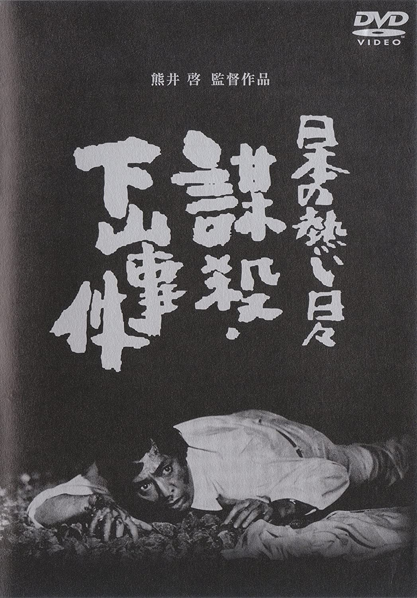

------

------

日本の熱い日々 謀殺・下山事件 (Nihon no Atsui Hibi Bosatsu Shimoyama Jiken / Willful Murder) 是1981年熊井启监督，矢田喜美雄原作，菊岛隆三剧本，佐藤胜音乐，仲代达矢 / 山本圭主演的电影。此片根据日本国铁三大疑案中的同名事件改编而成。中文字幕由coralsundy自费出资，neola09听译制作。适用于02:11:27的版本。由于电影年代久远，音轨质量一般，听译难免错漏，敬请谅解。

------

**No English Subtitle**

------

**听译/字幕**: noela09 (noela1990@outlook.com) 
**审核/调整**: coralsundy (coralsundy@gmail.com) 
*(由coralsundy自费出资制作, 仅供个人学习)*

------

**中文字幕**: [Willful.Murder.1981.chs.02-11-27.BYnoela09.rev1.srt](../subtitles/Willful.Murder.1981.chs.02-11-27.BYnoela09.rev1.srt) 
**English Subtitle**: None

------

**SUBHD**: <https://subhd.tv/a/548097> 
**IMDB**: <https://www.imdb.com/title/tt0083682/> 
**DOUBAN**: <https://movie.douban.com/subject/2121526/>

------

**More Movie Subtitles on My Website**: <a href=''>CLICK HERE</a>

