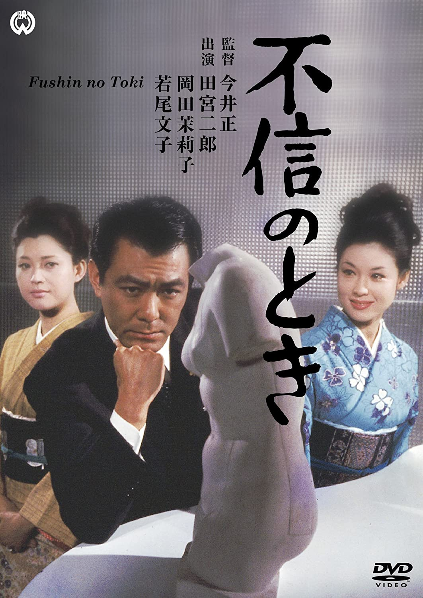

------

------

不信任的时候 / 不信のとき (Fushin no Toki / The Time of Reckoning) 是1968年今井正监督，有吉佐和子原作，井手俊郎剧本，富田勋音乐，若尾文子 / 田宮二郎 / 加贺麻理子 / 岸田今日子 / 岡田茉莉子 / 永井智雄主演的电影。田宫二郎因为此片海报排名问题，与大映会社产生矛盾，致使社长永田雅一启用五社协定，封杀田宫在电影界的出镜。中文字幕由coralsundy自费出资，neola09听译制作。适用于01:59:29的版本。由于电影年代久远，音轨质量一般，听译难免错漏，敬请谅解。

------

**No English Subtitle**

------

**听译/字幕**: noela09 (noela1990@outlook.com) 
**审核/调整**: coralsundy (coralsundy@gmail.com) 
*(由coralsundy自费出资制作, 仅供个人学习)*

------

**中文字幕**: [Fushin.no.Toki.aka.The.Time.of.Reckoning.1968.chs.01-59-29.BYnoela09.rev1.srt](../subtitles/Fushin.no.Toki.aka.The.Time.of.Reckoning.1968.chs.01-59-29.BYnoela09.rev1.srt) 
**English Subtitle**: None

------

**SUBHD**: <https://subhd.tv/a/549469> 
**IMDB**: <https://www.imdb.com/title/tt0204335/> 
**DOUBAN**: <https://movie.douban.com/subject/3011604/>

------

**More Movie Subtitles on My Website**: <a href=''>CLICK HERE</a>

