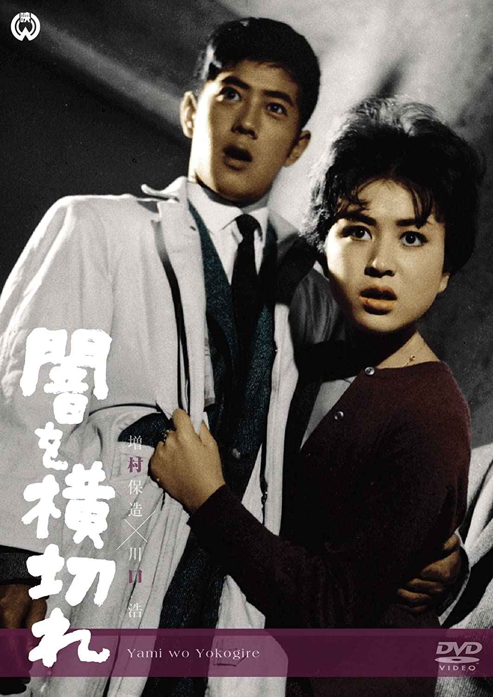

------

------

闇を横切れ / 穿越黑暗 (Yami o Yokogire / Across Darkness) 是增村保造于1959年导演，菊岛隆三 / 增村保造共同脚本，川口浩 / 山村聪 / 叶顺子 / 泷泽修 / 高松英郎主演的电影。英文字幕由coralsundy自费出资，jls001999听译制作完成。有少许错漏和语句不够流畅，可全程完整欣赏电影，适用于01:42:46的版本。

------

Yami o Yokogire / Across Darkness (1959) ia a 1959 movie directed by Yasuzo Masumura, with notable stars Hiroshi Kawaguchi, So Yamamura, Junko Kano, Osamu Takizawa, and Hideo Takamatsu.

------

**Translation/Subtitle**: jls001999 (jls001999@gmail.com) 
**Review/Proofreading**: coralsundy (coralsundy@gmail.com) 
*(Paid by coralsundy for the translation, personal use only)*

------

**中文字幕**: 尚无 
**English Subtitle**: [Yami.o.Yokogire.aka.Across.Darkness.1959.eng.01-42.46.BYjls001999.rev1.srt](../subtitles/Yami.o.Yokogire.aka.Across.Darkness.1959.eng.01-42.46.BYjls001999.rev1.srt)

------

**SUBHD**: <https://subhd.tv/a/550682> 
**IMDB**: <https://www.imdb.com/title/tt0276755/> 
**DOUBAN**: <https://movie.douban.com/subject/3169333/>

------

**More Movie Subtitles on My Website**: <a href=''>CLICK HERE</a>

