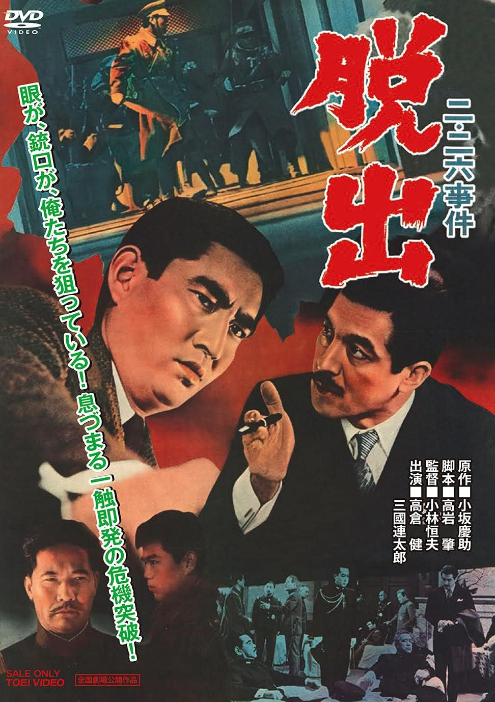

------

------

二·二六事件 脱出 (Ni-nirokushiken Daisshutsu / The Escape) 是1962年小林恒夫监督，小坂庆助原作，高岩肇剧本，木下忠司音乐，高仓健 / 三国连太郎 / 千叶真一主演的电影。中文字幕由coralsundy自费出资，neola09听译制作。适用于01:36:31的版本。由于电影年代久远，音轨质量一般，听译难免错漏，敬请谅解。

------

**No English Subtitle**

------

**听译/字幕**: noela09 (noela1990@outlook.com) 
**审核/调整**: coralsundy (coralsundy@gmail.com) 
*(由coralsundy自费出资制作, 仅供个人学习)*

------

**中文字幕**: [Ni-nirokushiken.Daisshutsu.aka.The.Escape.1962.chs.01-36-31.BYnoela09.rev1.srt](../subtitles/Ni-nirokushiken.Daisshutsu.aka.The.Escape.1962.chs.01-36-31.BYnoela09.rev1.srt) 
**English Subtitle**: None

------

**SUBHD**: <https://subhd.tv/a/551405> 
**IMDB**: <https://www.imdb.com/title/tt11428202/> 
**DOUBAN**: <https://movie.douban.com/subject/30459705/>

------

**More Movie Subtitles on My Website**: <a href=''>CLICK HERE</a>

