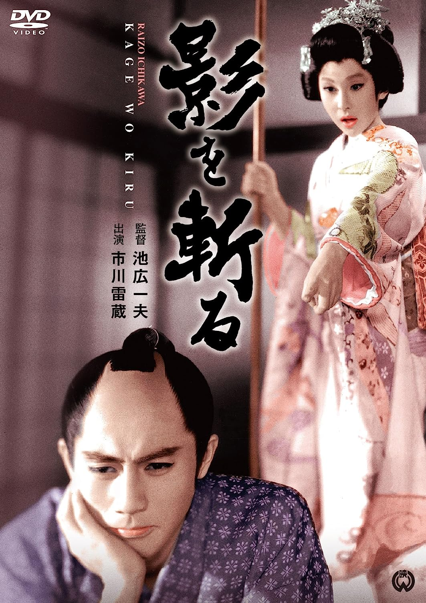

------

------

胭脂虎影 / 影を斬る (Kage o Kiru / Cut The Shadow) 是池广一夫于1963年导演，小国英雄脚本，齐藤一郎音乐，市川雷藏 / 瑳峨三智子主演的电影。英文字幕由coralsundy自费出资，jls001999听译制作完成。有少许错漏和语句不够流畅，可全程完整欣赏电影，适用于01:22:09的版本。
 
 
**注：**胭脂虎其实是一出京剧剧名，又叫“会稽城”和“元帅牵马”。内容是演唐代扬州妓女石中玉因不愿做皇帝的妃嫔，逃到会稽和军营副将王行瑜订了婚约。事被元帅李景让得知，将二人拿到帅府，责备石中玉不该引诱将官。石中玉侃侃申辩，李更发怒，下令将二人斩首，三军不服而鼓噪；李的母亲急忙出堂，赦了二人，责备李景让，重定军心。这时庞勋攻城，众将不敌，李景让惶急无计，石中玉自告奋勇愿去退兵，但要李认她为义妹，并且要亲自代她扛刀牵马，李景让不得已一一照办，石中玉果然擒住了庞勋，得胜回城。  
 
本剧中的女主，有胆有识，还会武功，所以借了这个名字“胭脂虎”然后再加个“影”，用于贴合日语片名原来的意思。
 
(感谢微博[步亭先生](https://weibo.com/u/7756344026)帮助提供中文译名，并解释以上背景提要)

------

Kage o Kiru / Cut The Shadow (1963) is a 1963 movie directed by Kazuo Ikehiro, with notable stars Raizo Ichikawa and Michiko Saga.

------

**Translation/Subtitle**: jls001999 (jls001999@gmail.com) 
**Review/Proofreading**: coralsundy (coralsundy@gmail.com) 
*(Paid by coralsundy for the translation, personal use only)*

------

**中文字幕**: 尚无 
**English Subtitle**: [Kage.o.Kiru.aka.Cut.The.Shadow.1963.eng.01-22-09.BYjls001999.rev1.srt](../subtitles/Kage.o.Kiru.aka.Cut.The.Shadow.1963.eng.01-22-09.BYjls001999.rev1.srt)

------

**SUBHD**: <https://subhd.tv/a/551494> 
**IMDB**: <https://www.imdb.com/title/tt0165342/> 
**DOUBAN**: <https://movie.douban.com/subject/24719833/>

------

**More Movie Subtitles on My Website**: <a href=''>CLICK HERE</a>

