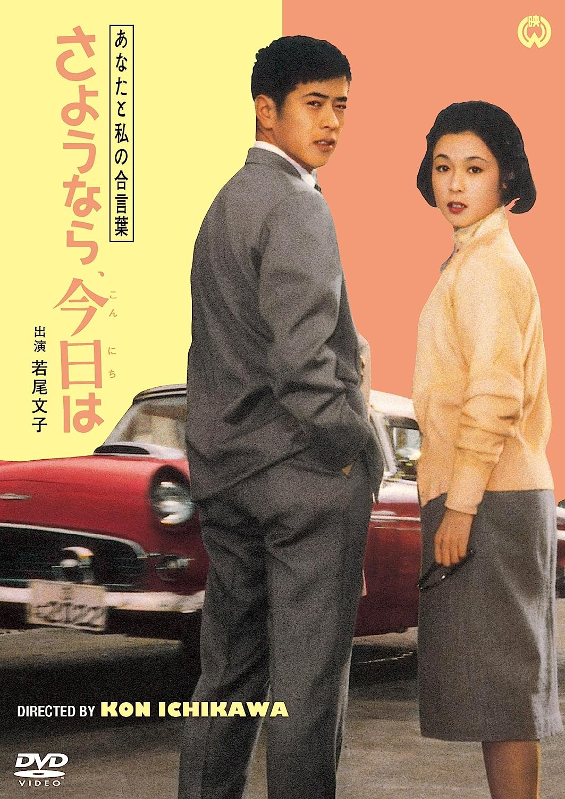

------

------

我们俩的暗号: 你好、再见 / あなたと私の合言葉 さよなら、今日は (Anata to Watashi no Aikotoba Sayonara Konnichiwa / Goodbye, Hello) 是市川昆于1963年导演，久里子亭原作，久里子亭 / 舟桥和郎合作脚本，塚原晢夫音乐， 若尾文子 / 京町子 / 川口浩 / 田宫二郎 / 船越英二 / 佐分利信 / 野添瞳主演的电影。英文字幕由coralsundy自费出资，jls001999听译制作完成。有少许错漏和语句不够流畅，可全程完整欣赏电影，适用于01:26:36的版本。由于电影年代久远，音轨质量一般，听译难免错漏，敬请谅解。
 
 
(注：本片无论是在dvd还是在流媒高清上，音轨质量都很一般，听译十分艰难，因此错漏可能比往常大幅度增加，抱歉。)

------

Anata to Watashi no Aikotoba Sayonara Konnichiwa / Goodbye, Hello (1959) ia a 1959 movie directed by Kon Ichikawa, with notable stars Ayako Wakao, Machiko Kyo, Hiroshi Kawaguchi, Jiro Tamiya, Eiji Funakoshi, Shin Saburi, and Hitomi Nozoe.

------

**Translation/Subtitle**: jls001999 (jls001999@gmail.com) 
**Review/Proofreading**: coralsundy (coralsundy@gmail.com) 
*(Paid by coralsundy for the translation, personal use only)*

------

**中文字幕**: 尚无 
**English Subtitle**: [Anata.to.Watashi.no.Aikotoba.Sayonara.Konnichiwa.aka.Goodbye.Hello.1959.eng.01-26-36.BYjls001999.rev1.srt](../subtitles/Anata.to.Watashi.no.Aikotoba.Sayonara.Konnichiwa.aka.Goodbye.Hello.1959.eng.01-26-36.BYjls001999.rev1.srt)

------

**SUBHD**: <https://subhd.tv/a/551896> 
**IMDB**: <https://www.imdb.com/title/tt0053246/> 
**DOUBAN**: <https://movie.douban.com/subject/2360920/>

------

**More Movie Subtitles on My Website**: <a href=''>CLICK HERE</a>

